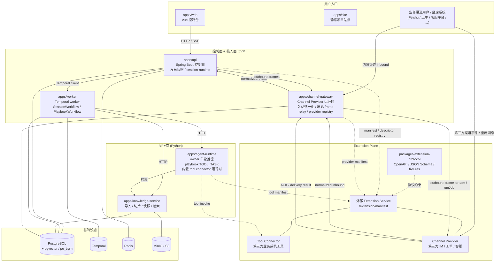

AgentYard
=========

> 让企业以最小成本拥有可治理、可发布、可观测的智能体系统。
>
> *A release-driven agent system — currently in active development.*

[](https://github.com/Agent-Yard/agentyard/actions/workflows/ci.yml)


---

## 项目状态

AgentYard 当前处于活跃开发期 (alpha)。代码已经走通了 **控制面 → 发布快照 → Temporal 长流程 → Python agent runtime** 的真实主链路，但仍保留若干原型边界：默认单租户、开发态保留 bootstrap 登录旁路、运维与生产治理仍在补齐。**接口、数据结构、配置项均可能在小版本之间发生不兼容变更**，文档可能短暂落后于代码，请以源码为准。

如果你正在评估是否引入 AgentYard，建议先以本地联调和概念学习为目标，生产化使用请关注后续里程碑。

## 演示视频

**会话演示** — 最简单场景下的一次会话（[B 站镜像](https://www.bilibili.com/video/BV1eDLp6hEV4/)）。

https://github.com/user-attachments/assets/e718df4b-5a02-41c9-808e-d4ac6ed5b370

**后台演示** — 业务域、助手、智能体、知识库、资源与发布快照的治理面走查（[B 站镜像](https://www.bilibili.com/video/BV1eSLp6wE9X/)）。

https://github.com/user-attachments/assets/86013c3e-986d-45f5-986b-d4db57312507

## 它解决什么问题

企业落地智能体系统普遍卡在三件事：自建成本太高、业务系统接入太重、跑起来后不可观测/不可治理。AgentYard 的设计取舍围绕这三点展开：

- **配置即契约**：业务域 / 业务场景 / 助手 / 智能体 / 知识库 / 资源都是一级治理对象，发布即冻结快照，运行态只消费 release。
- **协议化业务接入**：Tool Connector 与 Channel Provider 通过统一的 *Extension Plane* 协议接入，业务系统的鉴权、签名、长连接细节不再泄漏到 Agent / Playbook / Session。
- **强流程下沉到 Temporal**：Owner Agent 只做单轮决策；强业务流程作为 `PlaybookWorkflow` 的 child workflow 跑在 Temporal 上，可挂起、可恢复、可观测。
- **会话级可观测**：Session、Session Event、Playbook Run、Shared State 全部落库；前端通过 SSE 实时拉取 owner、handoff、playbook、人工介入时间线。
- **自带知识检索**：内置 PostgreSQL `pgvector + pg_trgm + tsvector` 检索栈，知识导入、版本发布、快照检索全部异步可重试。

## 核心能力速览

| 主线 | 当前已落地 |
| --- | --- |
| 治理 | 业务域 / 业务场景 / 助手 / 智能体 / 知识库 / 资源（`TOOL / LLM_MODEL / SKILL`）目录与版本管理 |
| 发布 | Assistant Release 冻结主智能体、owner / session / playbook 策略、资源版本与编排图 |
| 运行 | `SessionWorkflow` + `PlaybookWorkflow` + Owner Agent 单轮推理 + 人工/外部恢复 signal |
| 接入 | `SIMPLE_HTTP` / `BUSINESS_CODE_SECRET_HTTP` / `MCP` Tool Connector，飞书 Channel Provider |
| 知识 | URL/文件导入 → 文档切片 → 索引快照 → 按发布快照检索；任务状态机 + 失败重试 + 检索验证工作台 |
| 观测 | session detail、shared state、event 时间线、playbook run；SSE 优先，轮询 fallback |
| 隐私 | Agent runtime 显式分层的 prompt 隐私策略（`SKIP / RULES_ONLY / RULES_THEN_PRIVATE_LLM`），fragment cache 仅落加密结果 |

## 架构概览



*Extension Plane* 是协议与注册边界（`packages/extension-protocol`），不是单独的核心运行面。外部 Extension Service 通过 `/extension/manifest` 声明 Channel Provider 与 Tool Connector；Channel Provider 侧由 `channel-gateway` 接收 normalized inbound、提供 outbound frame stream / ACK 边界，Tool Connector 侧由 `agent-runtime` 直接发起 tool invoke。核心服务自动注册由 `AGENTYARD_CHANNEL_GATEWAY_BASE_URL` / `AGENTYARD_AGENT_RUNTIME_BASE_URL` 提供，运营方扩展通过 `AGENTYARD_EXTENSION_REGISTRATION_FILE` 加载。

## 仓库结构

```text
apps/
  api/                Spring Boot 控制面 API
  channel-gateway/    Channel Provider 运行时（飞书等渠道接入）
  worker/             Temporal workflow worker
  web/                Vue + Ant Design Vue 控制台
  site/               Vite 静态项目站点 / 官网落地页
  agent-runtime/      Python owner agent / playbook tool task 运行时
  knowledge-service/  Python 知识导入 / 快照构建 / 检索服务
packages/
  contracts/             OpenAPI 与 TypeScript 共享契约
  contracts-jvm/         JVM 侧 session / playbook / runtime 契约
  extension-protocol/    Extension Plane 协议（OpenAPI + JSON Schema + 契约样例）
  extension-sdk-jvm/     JVM Extension SDK（协议常量、DTO 生成、manifest 校验、registration helper）
  extension-sdk-python/  Python Extension SDK（协议常量、canonical JSON、digest、registration 与 manifest 校验 helper）
  persistence-jvm/       JVM 侧共享 PostgreSQL persistence（jOOQ + shared store）
  python-common/         Python 服务共享工具
  shared-redis-jvm/      JVM 侧共享 Redis keyspace / lock / pubsub / codec
deploy/
  common/  跨环境共享的无密钥运行材料
  local/   本机联调 Docker Compose
  dev/     共享开发服务器常驻 Docker Compose
  test/    测试环境分模块发布模板
scripts/
  common/  环境变量装载与进程辅助
  local/   本地源码直跑脚本
  dev/     开发服务器源码直跑脚本
docs/
  architecture/      当前架构与环境说明
  briefing/          项目背景资料
  todo/              当前待办分解
  develop_record/    历史归档（不作为当前实现基准）
```

## 控制台导航

控制台采用五段式信息架构：

- **平台设计**：业务域、业务场景
- **助手构建**：助手配置、智能体、Playbook
- **知识库**：知识库目录、知识库新建
- **能力资源**：资源目录、资源新建
- **运行与观测**：会话运行

## 快速开始

### 0. 前置条件

- Java 25
- Node.js 22 + pnpm 9.12.0
- Python 3.11+ 与 [`uv`](https://docs.astral.sh/uv/)
- Docker / Docker Compose

### 1. 启动本地依赖

```bash
cd deploy/local
docker compose up -d
```

依赖包含 PostgreSQL（自带 `pgvector` / `pg_trgm`）、MinIO、Redis、Temporal 与 sandbox。
PostgreSQL 启动时会自动准备 `agentyard_core`、`agentyard_channel_gateway`、`agentyard_knowledge`、`agentyard_agent_runtime` 四个库，分别给 API/worker、channel-gateway、knowledge service、agent-runtime 使用。

### 2. 准备环境变量

```bash
cp .env.example .env
```

根目录 `.env` 会被所有 `pnpm local:*` 与 `pnpm local` 自动加载。示例已默认把 API、channel-gateway、knowledge service 指向不同数据库，避免互相污染。

### 3. 安装依赖

```bash
pnpm install
uv sync --all-packages
```

Python 依赖统一由根目录 `uv` workspace 管理；`uv` 会自动创建并维护虚拟环境。

### 4. 启动应用

一次拉起：

```bash
pnpm local
```

按服务拆开启动：

```bash
pnpm local:api
pnpm local:channel-gateway
pnpm local:worker
pnpm local:knowledge-service
pnpm local:agent-runtime
pnpm local:web
```

启动后常用入口：

| 服务 | 地址 |
| --- | --- |
| Web 控制台 | <http://localhost:5173> |
| API | <http://localhost:8080/api> |
| Channel Gateway | <http://localhost:8082> |
| Knowledge Service | <http://localhost:8091> |
| Agent Runtime | <http://localhost:8090> |
| Temporal UI | <http://localhost:8088> |
| MinIO Console | <http://localhost:9001> |

### 5. 模型与知识检索配置

至少配置一个真实 LLM provider 的 API key，运行态没有本地假响应 fallback。
OpenAI 兼容 endpoint 示例：

```bash
AGENTYARD_OPENAI_COMPATIBLE_BASE_URL=http://localhost:11434/v1
AGENTYARD_OPENAI_COMPATIBLE_MODEL_ID=custom-compatible-model
AGENTYARD_OPENAI_COMPATIBLE_API_KEY_ENV_VAR=OPENAI_COMPATIBLE_API_KEY
OPENAI_COMPATIBLE_API_KEY=your-token-if-needed
```

知识服务的 embedding provider 单独配置：

```bash
AGENTYARD_KNOWLEDGE_EMBEDDING_BASE_URL=http://localhost:11434/v1
AGENTYARD_KNOWLEDGE_EMBEDDING_MODEL=nomic-embed-text
AGENTYARD_KNOWLEDGE_EMBEDDING_API_KEY=your-token-if-needed
AGENTYARD_KNOWLEDGE_EMBEDDING_DIMENSIONS=768
```

如果模型响应较慢，可同步调大 worker 的 Temporal activity 超时：

```bash
AGENTYARD_TEMPORAL_ACTIVITY_START_TO_CLOSE_TIMEOUT=PT2M
```

仓库未提供 demo seed；业务域、资源与知识库需通过控制台或 API 显式创建。

### 6. 构建前端与站点

根目录 `pnpm build` 会顺序构建控制台 `@agentyard/web` 与静态项目站点 `@agentyard/site`。本地运行主链路的 `pnpm local` 只启动控制台 `apps/web`，不会启动 `apps/site`；如需调试站点，可单独执行：

```bash
pnpm --filter @agentyard/site dev
```

### 7. 远程 / 共享开发环境

如果你要把整套环境常驻在开发服务器上：

```bash
cp .env.dev.example .env.dev
pnpm dev               # Docker Compose 后台常驻
# 或者
pnpm dev:source        # 在服务器上从源码热加载运行
```

详细说明见 `docs/architecture/dev-environment.md`。

## 测试

```bash
./gradlew :apps:api:test :apps:worker:test :apps:channel-gateway:test
pnpm test:web
uv run --all-packages pytest
```

CI 在 `.github/workflows/ci.yml` 中分别跑 Java / Node / Python 三套检查，并对 jOOQ 生成产物做差异校验。

## 运行模型

当前运行链路已经收敛到“**发布快照驱动的 session-owner-playbook**”模型：

1. API 创建 `session`，按 assistant release 的 `primaryAgentId` 初始化 owner。
2. `SessionWorkflow` 接收用户消息 Update，维护 owner、shared state、handoff、idle timer 与 playbook 生命周期。
3. Worker 调用 Python `agent-runtime` `/agent-turns/execute-stream`，在 activity 内转发 transient stream frame，并只把最终 outcome 交给 workflow。
4. Owner agent 单轮推理后返回决策：`REPLY` / `NO_OP` / `SWITCH_OWNER` / `RUN_PLAYBOOK` / `SESSION_HUMAN_HANDOFF` / `SECURITY_BLOCK`；`replyMessage` 可与非 `REPLY` action 同时存在。
5. 若启动 playbook，则 `PlaybookWorkflow` 作为 child workflow 承担强流程，节点类型为 `STEP / TOOL_TASK / HUMAN_TASK / EXTERNAL_INTERACTION / END`。
6. playbook 等待、恢复、终态结果统一写入 `session event` / `playbook run`。
7. 非 handoff 状态下，playbook 终态会触发 owner reevaluation 继续推进。

关键契约与实现入口：

- [`SessionContracts.java`](packages/contracts-jvm/src/main/java/com/agentyard/contracts/session/SessionContracts.java)
- [`CatalogService.java`](apps/api/src/main/java/com/agentyard/platform/catalog/CatalogService.java)
- [`SessionRuntimeService.java`](apps/api/src/main/java/com/agentyard/platform/session/SessionRuntimeService.java)
- [`SessionWorkflowImpl.java`](apps/worker/src/main/java/com/agentyard/worker/session/SessionWorkflowImpl.java)
- [`PlaybookWorkflowImpl.java`](apps/worker/src/main/java/com/agentyard/worker/session/PlaybookWorkflowImpl.java)
- [`agent-runtime/main.py`](apps/agent-runtime/agentyard_agent_runtime/main.py)

## 文档索引

- 项目结构与对象模型：[`docs/project_structure.md`](docs/project_structure.md)
- 当前技术路线：[`docs/technical_route.md`](docs/technical_route.md)
- 当前代码框架：[`docs/architecture/code-framework.md`](docs/architecture/code-framework.md)
- Tool Connector 开发指导：[`docs/architecture/tool-connector-development.md`](docs/architecture/tool-connector-development.md)
- External Interaction 集成：[`docs/architecture/external-interaction-integration.md`](docs/architecture/external-interaction-integration.md)
- 本地与开发环境：[`docs/architecture/local-development.md`](docs/architecture/local-development.md)、[`docs/architecture/dev-environment.md`](docs/architecture/dev-environment.md)
- Extension Plane 协议：[`packages/extension-protocol/README.md`](packages/extension-protocol/README.md)
- 当前待办：[`docs/todo/`](docs/todo/)

`docs/develop_record/` 仅用于里程碑留档与过程记录，不作为“当前实现”的唯一准绳。

## 路线图

短期重点：

- 权限与身份：继续收敛 OIDC / IAM 与更细粒度授权
- 观测：在 `session event / playbook run` + SSE 上补派生视图、分页查询与审计账本
- 发布治理：灰度、回滚、版本 diff 与影响分析
- 运行基座：增强 Channel Provider / Tool Connector 生态、回调安全、运维告警与生产隔离

完整待办分解见 [`docs/todo/`](docs/todo/) 与 [`docs/project_todos.md`](docs/project_todos.md)。

## 参与贡献

欢迎 issue、讨论与 PR。在提 PR 前，请：

1. 阅读 [`AGENTS.md`](AGENTS.md) 了解仓库的全局重构原则与目录约定。
2. 本地跑通对应栈的测试（Java / Node / Python）。
3. 当 PR 影响数据模型、契约或发布快照时，同步更新 `docs/architecture/` 与 `docs/project_structure.md`。

## 联系方式

- 仓库：<https://github.com/Agent-Yard/agentyard>
- 反馈与建议：[GitHub Issues](https://github.com/Agent-Yard/agentyard/issues)
