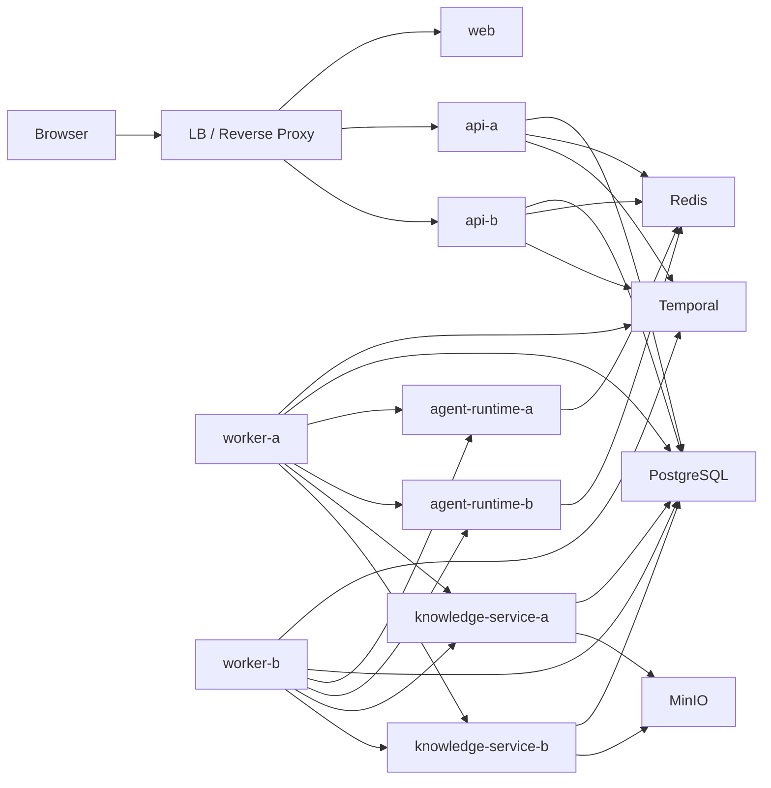

# Lynxus 多实例与共享状态实施总方案

> 本文不是 `docs/project_todos.md` §3.7 的简单展开，而是基于当前仓库真实代码、部署方式和服务边界整理出的完整实施方案。
> 目标是让 Lynxus 从“可本地联调、默认单实例的平台原型”直接重构为“支持多实例、共享状态一致”的目标架构。

## 1. 目标与范围

### 1.0 前提

本方案默认以下前提：

1. 项目当前处于开发阶段，按目标架构直接改，不做兼容性设计
2. 不考虑既有数据库数据、既有进程内状态模型、既有单实例行为的平滑迁移
3. 不以“先局部兼容、再逐步替换”为原则，优先消除错误的单机建模
4. 本文讨论的是架构改造本身，不展开正式发布、灰度切换和运维流程

### 1.1 目标

把当前 Lynxus 从默认单实例假设重构为具备以下能力的系统：

1. API 支持多实例无粘性访问
2. Session 运行态在多 API 实例下保持一致可观测
3. 登录态、短时协调态、热点缓存和幂等态具备共享存储
4. 控制面对象不会因实例内缓存漂移而读到旧数据
5. Worker、Agent Runtime、Knowledge Service 在横向扩容时不会引入新的隐式单机状态
6. 具备双实例以上的一致性验证路径

### 1.2 范围

本文覆盖：

- `apps/api`
- `apps/worker`
- `apps/agent-runtime`
- `apps/knowledge-service`
- `apps/web`
- `infra/local`
- `infra/dev`
- 共享依赖：PostgreSQL、Redis、Temporal、MinIO

本文不覆盖：

- 多租户隔离
- Kafka / 独立 MQ 引入
- 发布流程与运维体系
- SSE 之外的全站实时化

## 2. 先说结论

当前 Lynxus 并不是“只差把 Redis 接进 SSE”。

从代码现状看，真正阻断多实例的有五类问题：

1. API 仍有明确的本地会话锁与 HTTP Session 假设
2. `CatalogService` / `KnowledgeService` 把数据库快照镜像进了 JVM 内存并长期持有
3. Redis 已接入，但只完成了连通性和隐私映射首个落点，尚未形成统一共享状态能力层
4. 运行页仍是轮询模型，SSE 方案尚未落地，更没有跨实例广播
5. 多实例验证缺失，现有测试基本仍是单实例单进程语义

所以，这项工作必须按“系统级收口”推进，而不是按功能点零散补丁推进。

## 3. 当前项目真实状态盘点

以下判断都直接基于仓库当前代码，而不是主 TODO 文档的描述。

### 3.1 已经天然接近多实例的部分

#### Worker

- `apps/worker` 的长流程状态由 Temporal workflow 承载
- session / playbook / knowledge workflow 的权威状态不在 worker 进程内
- `JdbcSessionProjectionRepository` 只负责把投影写入 PostgreSQL
- 只要 activity 自身不持有进程内共享状态，worker 本身适合横向扩容

结论：

- Worker 不是 3.7 的主阻塞项
- 但后续若 activity 引入缓存、限流、去重，必须复用统一共享状态层

#### Agent Runtime

- `apps/agent-runtime` 当前已接入 Redis 并在启动时校验连通性
- 运行逻辑主要是单请求执行 `agent-turn` 或 `playbook-tool-task`
- 已暴露 `/healthz`
- 当前明确共享态只有隐私映射 Redis 存储

结论：

- Agent Runtime 当前整体接近无状态服务
- 需要纳入统一 keyspace 和配置治理，但不是主改造面

#### Knowledge Service

- 结构化数据已落 PostgreSQL
- 文件存储已落 MinIO 或 filesystem
- 异步导入 / 建索引由 Temporal workflow 驱动，不靠进程内后台线程
- 代码里没有明显的长期进程级业务缓存

结论：

- Knowledge Service 也接近无状态
- 但缺少健康端点、统一共享状态约束和多实例专项验证

#### Web

- 前端已经切到 API 托管会话
- 浏览器通过同域 HttpOnly session cookie 调 `/api`
- 前端本身不存在服务端内存态问题

结论：

- Web 不是多实例一致性的核心问题
- 但登录态和 SSE 接入方式必须与 API 多实例方案对齐

### 3.2 当前明确阻断多实例的部分

#### API 的本地锁

[`SessionDispatchLockService`](../../apps/api/src/main/java/com/lynxus/platform/session/SessionDispatchLockService.java) 当前使用：

- `ConcurrentHashMap`
- `ReentrantLock`

来保护：

- 同一 `sessionId` 的消息投递窗口
- 同一 `customerId + assistantId` 的 session 复用 / 创建窗口

这在单实例下有效，在多实例下完全失效。

#### API 的登录态仍是本地 HttpSession 语义

[`AuthSecurityConfiguration`](../../apps/api/src/main/java/com/lynxus/platform/auth/AuthSecurityConfiguration.java) 当前使用：

- `HttpSessionSecurityContextRepository`
- `SessionCreationPolicy.IF_REQUIRED`

但 `apps/api/build.gradle.kts` 里尚未引入 `spring-session-data-redis`，说明登录态仍然依赖当前节点的 servlet session 机制。

结果：

- 请求一旦分布到不同 API 实例，登录态就无法可靠共享

#### CatalogService / KnowledgeService 把数据库状态长期镜像在进程内

[`CatalogService`](../../apps/api/src/main/java/com/lynxus/platform/catalog/CatalogService.java) 当前持有：

- `initialized`
- `domains`
- `scenarios`
- `assistants`
- `agents`
- `playbooks`
- `resources`
- `resourceVersions`
- `assistantReleases`

并通过 `ensureLoaded()` 首次加载后长期驻留进程内。

[`KnowledgeService`](../../apps/api/src/main/java/com/lynxus/platform/knowledge/KnowledgeService.java) 当前也持有：

- `initialized`
- `knowledgeBases`
- `knowledgeReleases`

这意味着：

- 实例 A 更新后，实例 B 可能继续用旧内存快照
- 即使底层 PostgreSQL 是共享的，服务层读取语义仍是实例本地快照

这不是“缓存策略选择”问题，而是当前服务建模本身仍偏单机。

#### SSE 尚未落地，更没有跨实例广播

当前运行页仍通过：

- `GET /api/session-runtime/sessions`
- `GET /api/session-runtime/sessions/{sessionId}`

轮询刷新。

而 `docs/todo/sse_plan.md` 里的首版方案仍默认：

- API 进程内维护连接注册表
- API 进程内维护 replay buffer

所以即使 SSE 落地，如果不改模型，也仍然只适用于单实例。

#### Redis 使用方式尚未收口为平台能力层

目前代码里 Redis 的实际使用非常有限：

- `apps/api`：连通性校验 + 读取隐私映射摘要
- `apps/worker`：连通性校验
- `apps/agent-runtime`：隐私映射 store

但还没有统一的：

- key 命名规范
- TTL 规范
- codec / 序列化规范
- pub/sub 封装
- 锁封装
- 幂等封装
- cache invalidation 封装

继续让业务模块各自直接拼 Redis key，会把 3.7 做成新的技术债。

### 3.3 当前支持多实例的基础已经存在

虽然问题不少，但并不是从零开始。当前仓库已经具备以下前提：

1. `infra/local` 和 `infra/dev` 都已提供 Redis
2. API / Worker / Agent Runtime 已统一接入 `LYNXUS_REDIS_*`
3. Session 运行态、平台用户、catalog、knowledge 元数据已经落 PostgreSQL
4. Worker 的工作流执行边界已经收敛到 Temporal
5. Agent Runtime 的隐私映射首版已经验证“运行态共享状态放 Redis”是可行的

所以 3.7 的真实工作不是“是否引入 Redis”，而是“把 Redis 从一个孤立接入点升级为平台共享状态层”。

## 4. 现阶段推荐的目标架构

### 4.1 权威事实分层

必须先统一权威边界，否则后续会混乱。

#### PostgreSQL

负责长期业务事实：

- 平台用户
- catalog 元数据
- knowledge 元数据
- session runtime 投影
- platform event 审计账本

#### Temporal

负责长时运行控制：

- SessionWorkflow
- PlaybookWorkflow
- KnowledgeImportWorkflow
- KnowledgeIndexBuildWorkflow

#### Redis

只负责共享运行态和短时协调态：

- HTTP Session
- SSE replay buffer
- 跨实例事件广播
- 短 TTL 分布式锁
- 幂等记录
- 共享限流计数
- 目录热点缓存和失效信号
- session 级隐私映射与摘要

关键原则：

- Redis 不承载长期业务真相
- Redis 也不替代 Temporal workflow 单例语义

### 4.2 推荐部署拓扑

设计要点：

1. Web 与 API 允许多实例
2. API 之间完全无粘性
3. Worker 通过 Temporal task queue 扩容
4. Agent Runtime / Knowledge Service 可按无状态 HTTP 服务扩容
5. 所有共享短时状态只通过 Redis 协调

## 5. 核心设计原则

### 5.1 共享状态必须经统一能力层访问

不能接受业务代码继续到处直接 `StringRedisTemplate` / `Redis.from_url` 后拼 key。

建议新增统一能力层：

- `com.lynxus.platform.shared.redis.RedisKeyspace`
- `com.lynxus.platform.shared.redis.RedisCodec`
- `com.lynxus.platform.shared.redis.RedisPubSubBus`
- `com.lynxus.platform.shared.redis.RedisLockService`
- `com.lynxus.platform.shared.redis.RedisIdempotencyService`
- `com.lynxus.platform.shared.redis.RedisCacheService`
- `com.lynxus.platform.shared.redis.RedisInvalidationBus`

Python 侧同步建立 helper：

- `apps/agent-runtime/lynxus_agent_runtime/redis_support.py`
- 后续若 `knowledge-service` 需要 Redis，也走同一命名规则

### 5.2 先消除单机建模，再做缓存优化

`CatalogService` / `KnowledgeService` 当前最大问题不是“没有 Redis cache”，而是“先把 DB 快照镜像进了内存再长期持有”。

所以顺序必须是：

1. 先改成 repository-first 读模型
2. 再按热点引入共享缓存
3. 最后再决定要不要保留极薄的本地 L1 cache

不能为了保住现在的写法而给它包一层 Redis。

### 5.3 短时锁只做短时协调

分布式锁只用于：

- session 复用 / 创建窗口
- API 侧短时投递窗口
- 极短临界区去重

不能用于：

- 串行整个 SessionWorkflow 生命周期
- 替代 Temporal 的单例与顺序保证

### 5.4 共享 key 必须统一命名与 TTL

建议首版统一为：

- `lynxus:sse:event:{sessionId}`
- `lynxus:sse:channel:session-updated`
- `lynxus:cache:catalog:{key}`
- `lynxus:cache:knowledge:{key}`
- `lynxus:cache:invalidate:catalog`
- `lynxus:session:http:{id}`
- `lynxus:idempotency:{domain}:{key}`
- `lynxus:lock:{domain}:{key}`
- `lynxus:rate-limit:{scope}:{key}`
- `lynxus:privacy:session:{sessionId}:...`

TTL 原则：

- SSE replay：15 分钟
- 分布式锁：5-15 秒
- 幂等记录：24 小时，provider 可覆盖
- 热点缓存：5-30 分钟，必须带主动失效
- HTTP Session：跟随实际 session 策略

## 6. 分工作流实施方案

### 工作流 A：共享状态基座

这是整个方案的起点。

#### 目标

建立可复用、可监控、可测试的 Redis 能力层，而不是让业务模块各自接。

#### 交付

1. API 新增统一 Redis 能力包
2. 统一 `instanceId` 配置与日志字段
3. 统一 keyspace、TTL、JSON codec
4. 基础指标：
   - pub/sub publish count
   - subscriber lag
   - lock acquire success/fail
   - idempotency hit/miss
   - cache hit/miss
5. Redis 相关配置清单补齐到环境变量规范

#### 代码面

- `apps/api/build.gradle.kts`
- `apps/api/src/main/java/com/lynxus/platform/shared/redis/...`
- `apps/agent-runtime/lynxus_agent_runtime/redis_support.py`

#### 完成标准

- 新能力具备单元测试
- 业务模块不再新增裸 Redis key 拼接

### 工作流 B：API 多实例会话去本地化

这是 3.7 的第一主线。

#### 目标

让 API 在多实例架构下不依赖本地会话和本地锁。

#### 子任务 B1：Spring Session + Redis

需要变更：

1. `apps/api/build.gradle.kts` 引入 `spring-session-data-redis`
2. 用 Redis 承载 Spring Security 会话
3. 校准 cookie 策略：
   - `HttpOnly`
   - `Secure`
   - `SameSite`
4. 补跨实例登录集成测试

当前代码依据：

- `AuthSecurityConfiguration` 仍是 `HttpSessionSecurityContextRepository`
- 前端已经假设 API 托管会话，不需要前端 token 改造

#### 子任务 B2：本地锁替换为分布式锁

需要替换：

- `SessionDispatchLockService.withConversationLock`
- `SessionDispatchLockService.withSessionLock`

实现要求：

1. owner token
2. TTL
3. compare-and-delete 释放
4. 指标与超时日志

不允许：

- 裸 `DEL`
- 不带过期时间的锁

#### 子任务 B3：关键入口幂等化

首批必须覆盖：

- `external-callback`
- 真实 provider webhook
- 高风险控制面写接口

策略：

- webhook 优先使用 provider event id
- 控制面写接口使用显式 `Idempotency-Key`

### 工作流 C：Session Runtime 跨实例推送

这是第二主线，也是 API 多实例用户体验能否成立的关键。

#### 当前状态

- 运行页仍轮询
- `docs/todo/sse_plan.md` 仍是单实例方案

#### 目标

把 SSE 方案改造成真正支持多 API 实例。

#### 方案

1. 仍保持 `SESSION_SNAPSHOT / SESSION_UPDATED` 完整 detail 契约
2. replay buffer 放 Redis，而不是本机内存
3. session 更新通知走 Redis Pub/Sub
4. API 实例只维护本机 emitter，不维护全局事实
5. `Last-Event-ID` 重连优先读 Redis replay，miss 时回退快照

#### 推荐事件流

1. 任一 API 实例发现 session detail 已变化
2. 重新加载权威 `SessionRuntimeDetail`
3. 写入 `lynxus:sse:event:{sessionId}`
4. 发布 `lynxus:sse:channel:session-updated`
5. 所有 API 实例各自给本机连接的 `sessionId` 推送

#### 与现有代码的边界

- 不改 worker 持久化事实来源
- 不引入独立消息总线
- 不重新设计 delta 协议

### 工作流 D：控制面状态去内存化

这是整套方案最重要、也最容易被漏掉的部分。

#### 当前问题

`CatalogService` / `KnowledgeService` 当前是：

- 首次 load
- 驻留 JVM 内存
- 所有读写都围绕这个内存镜像展开
- 写回时再整体 `repository.save(...)`

这会造成：

1. 多实例读漂移
2. 更新覆盖窗口难以控制
3. 后续做共享缓存时职责混乱

#### 目标

把控制面读写模式改造成：

1. repository-first
2. 服务层不持有长期可变镜像
3. 热点读可以附加共享缓存
4. 缓存失效由发布 / 更新事件驱动

#### 推荐落地方式

##### D1：先改读路径

- 列表 / 详情 / references / preview 等查询直接从 repository 读取
- 保留 DTO 组装逻辑，但不保留长期驻留镜像

##### D2：再改写路径

- 将“读当前状态 -> 计算新快照 -> 保存”的逻辑改为显式事务边界
- repository 保存后立刻发失效事件

##### D3：最后按热点补缓存

首批热点候选：

- catalog summary
- assistant release 展开结果
- resource center
- knowledge base release summary

#### 注意事项

`JdbcCatalogRepository.save(...)` / `JdbcKnowledgeRepository.save(...)` 当前是整表替换式写入。

这意味着：

- 首版缓存失效不能做得过细
- 应优先使用对象域级或功能域级失效
- 不要过早承诺“精确到对象字段”的缓存失效粒度

### 工作流 E：服务治理与健康检查

这部分不属于“共享状态”本身，但从当前代码状态看，必须与 3.7 同步补。

#### 当前状态

- API 只有 `/api/system/health`，内容基本是静态返回
- Agent Runtime 有 `/healthz`
- Knowledge Service 没有显式 health/readiness endpoint
- Worker 没有标准对外健康端点

#### 为什么 3.7 必须带上它

多实例架构下如果没有 readiness / liveness / dependency-aware health：

- 实例健康状态无法被准确识别
- 异常实例无法被及时隔离
- API 与内部服务故障会变成随机请求失败

#### 本轮建议

1. API：把当前 health 拆成 liveness / readiness
2. Knowledge Service：补 `/healthz`，校验 PostgreSQL/MinIO/embedding config 基本可用
3. Agent Runtime：保留 `/healthz`，增加 Redis dependency details
4. Worker：至少补进程存活与 Temporal connectivity 验证

### 工作流 F：多实例限流

#### 当前状态

- 代码里还没有真正的限流实现
- 但 `apps/api` 已接入 Redis starter，技术条件已具备

#### 建议

- API 首版直接使用 Bucket4j + Redis backend

首批接口：

- `/api/auth/*`
- `/api/session-runtime/sessions/*/messages`
- `/api/session-runtime/sessions/*/human-reply`
- `/api/session-runtime/sessions/*/external-callback`
- provider webhook 入口

#### 原则

- key 语义要先统一，即便未来上收 API Gateway 也不改行为定义

## 7. 服务级落地顺序建议

### Phase 0：共享状态基座

必须先做，因为后续所有工作流都依赖它。

### Phase 1：API 多实例会话去本地化

先做：

1. Spring Session
2. 分布式锁
3. 幂等基座

原因：

- 这是 API 多实例的硬门槛
- 不解决这个，API 访问仍然绑定本地实例状态

### Phase 2：SSE 跨实例广播

紧接着做，因为它直接决定运行页多实例体验是否成立。

### Phase 3：Catalog / Knowledge 去内存化

这是系统性正确性的主修项。

虽然对用户最不显眼，但不做这一步，多实例只是“看起来能跑”。

### Phase 4：限流与 provider 协同

放在后面，是因为它更依赖真实业务入口和流量模型。

### Phase 5：双实例环境验证

最后再进入：

- 双 API / 双 Worker 环境
- 故障注入验证
- Redis / API / Worker 单点失效验证

## 8. 依赖与代码变更清单

### 8.1 预期新增依赖

#### API

- `spring-session-data-redis`
- 限流库：Bucket4j 或同级替代
- 如需要更强 Redis 操作支持，可引入更明确的 Redis client 封装

#### 测试

- Redis Testcontainers
- 需要时补充多容器集成测试基座

### 8.2 重点改造文件

#### `apps/api`

- [AuthSecurityConfiguration.java](/Users/eric/projects/lynxus/apps/api/src/main/java/com/lynxus/platform/auth/AuthSecurityConfiguration.java)
- [SessionDispatchLockService.java](/Users/eric/projects/lynxus/apps/api/src/main/java/com/lynxus/platform/session/SessionDispatchLockService.java)
- [SessionRuntimeService.java](/Users/eric/projects/lynxus/apps/api/src/main/java/com/lynxus/platform/session/SessionRuntimeService.java)
- [CatalogService.java](/Users/eric/projects/lynxus/apps/api/src/main/java/com/lynxus/platform/catalog/CatalogService.java)
- [KnowledgeService.java](/Users/eric/projects/lynxus/apps/api/src/main/java/com/lynxus/platform/knowledge/KnowledgeService.java)
- [SystemController.java](/Users/eric/projects/lynxus/apps/api/src/main/java/com/lynxus/platform/system/SystemController.java)
- `apps/api/src/main/java/com/lynxus/platform/shared/redis/*`

#### `apps/agent-runtime`

- [main.py](/Users/eric/projects/lynxus/apps/agent-runtime/lynxus_agent_runtime/main.py)
- [redis_support.py](/Users/eric/projects/lynxus/apps/agent-runtime/lynxus_agent_runtime/redis_support.py)
- [data_security/store.py](/Users/eric/projects/lynxus/apps/agent-runtime/lynxus_agent_runtime/data_security/store.py)

#### `apps/knowledge-service`

- [main.py](/Users/eric/projects/lynxus/apps/knowledge-service/lynxus_knowledge_service/main.py)

#### `infra`

- [infra/dev/docker-compose.yml](/Users/eric/projects/lynxus/infra/dev/docker-compose.yml)
- [infra/local/docker-compose.yml](/Users/eric/projects/lynxus/infra/local/docker-compose.yml)

## 9. 测试与验收矩阵

当前仓库缺的不是普通单元测试，而是多实例语义测试。

### 9.1 必须新增的测试层次

#### 单元测试

覆盖：

- Redis keyspace
- 分布式锁 acquire/release
- 幂等记录命中与过期
- cache invalidation 语义

#### API 集成测试

至少要有：

1. 双 API 实例共享 Redis Session
2. 双 API 实例共享分布式锁
3. 双 API 实例共享幂等键
4. 双 API 实例 SSE replay / broadcast

#### 端到端场景测试

必须覆盖：

1. 在实例 A 建立会话，在实例 B 请求 `/api/auth/session`
2. SSE 连接在实例 B，session 更新由实例 A 触发
3. 并发 createSession 不产生重复活跃 session
4. 同一 webhook 打到两个实例只处理一次
5. catalog 更新在另一实例立即可见

### 9.2 最低验收场景

1. 请求分布到不同 API 实例时，控制台会话仍保持一致
2. 单个 API 实例重启后，其余实例仍能继续服务并保持共享状态一致
3. 运行页 SSE 在跨实例情况下可持续收到更新
4. 同一 session 并发写请求不会重复推进
5. catalog / knowledge 元数据不会因实例差异出现读漂移
6. Redis 故障时，系统能明确失败或阻断，而不是静默错误

## 10. 风险点

#### 最大风险 1：控制面去内存化改造过大

这是工作量最大也最容易破坏现有行为的一段。

控制策略：

- 先读路径去内存化
- 再写路径收口
- 最后再加缓存

#### 最大风险 2：分布式锁设计不当

如果锁粒度太大或释放不安全，会带来：

- 误阻塞
- 死锁假象
- 难排障

控制策略：

- 仅覆盖短时临界区
- 严格 owner token 校验释放
- 记录 acquire latency 和 contention 日志

#### 最大风险 3：Redis 被滥用成事实存储

控制策略：

- 明确文档和代码边界
- 所有 Redis 能力都通过平台包访问
- PR review 时禁止业务侧裸写 Redis 业务事实

## 11. 最终建议

如果只从 `project_todos` 的文字出发，3.7 很容易被做成：

- SSE + Redis Pub/Sub
- Spring Session
- 限流

然后宣称“多实例支持完成”。

但从当前仓库实际实现看，这样做是不够的。真正必须一起完成的，是：

1. API 多实例会话去本地化
2. Session Runtime 跨实例推送
3. Catalog / Knowledge 去内存化
4. Redis 共享状态能力层收口
5. 多实例专项测试与双实例环境验证

只有这五件事一起闭环，Lynxus 才能从“默认单机原型”真正进入“可横向扩的系统”。
