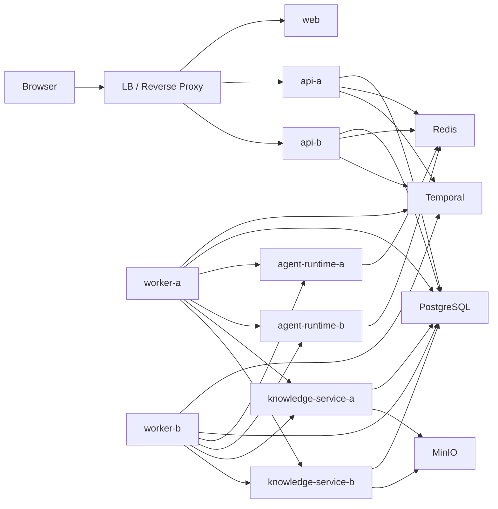

# Lynxus 多实例与共享状态实施总方案

> 本文不是 `docs/project_todos.md` §3.6（多实例一致性）的简单展开，而是基于当前仓库真实代码、部署方式和服务边界整理出的完整实施方案。
> 目标是让 Lynxus 从“可本地联调、默认单实例的平台原型”直接重构为“支持多实例、共享状态一致”的目标架构。

## 1. 目标与范围

### 1.0 前提

本方案默认以下前提：

1. 项目当前处于开发阶段，按目标架构直接改，不做兼容性设计
2. 不考虑既有数据库数据、既有进程内状态模型、既有单实例行为的平滑迁移
3. 不以“先局部兼容、再逐步替换”为原则，优先消除错误的单机建模
4. 本文讨论的是架构改造本身，不展开正式发布、灰度切换和运维流程

### 1.1 目标

把当前 Lynxus 从默认单实例假设重构为具备以下能力的系统：

1. API 支持多实例无粘性访问
2. Session 运行态在多 API 实例下保持一致可观测
3. 登录态、短时协调态、热点缓存和幂等态具备共享存储
4. 控制面对象不会因实例内缓存漂移而读到旧数据
5. Worker、Agent Runtime、Knowledge Service 在横向扩容时不会引入新的隐式单机状态
6. 具备双实例以上的一致性验证路径

### 1.2 范围

本文覆盖：

- `apps/api`
- `apps/worker`
- `apps/agent-runtime`
- `apps/knowledge-service`
- `apps/web`
- `infra/local`
- `infra/dev`
- 共享依赖：PostgreSQL、Redis、Temporal、MinIO

本文不覆盖：

- 多租户隔离
- Kafka / 独立 MQ 引入
- 发布流程与运维体系
- SSE 之外的全站实时化

## 2. 先说结论

截至 2026-04-21，本方案的前四项主干工作已经在本地落地：

1. 共享状态能力层 `packages/shared-redis-jvm` 已抽出，`api` / `worker` 共同依赖
2. API 已接入 `spring-session-data-redis`，`SessionDispatchLockService` 已改走 `RedisLockService`，并新增 `RedisIdempotencyService` / `RedisInvalidationBus`
3. Session Runtime 跨实例流式链路已落地：`SessionRuntimeStreamService` + `SessionRuntimeReplayStore` + `SessionRuntimeChangeNoticePublisher`（API）与 `SessionRuntimeChangePublisher`（worker）通过 Redis Pub/Sub 协同
4. `CatalogService` / `KnowledgeService` 已从进程内 JVM 镜像模型切换为 repository-first 读写，并开始接入 revision / invalidation 语义

当前仍未闭环的主要缺口：

1. 幂等基座已覆盖 `external-callback`：显式 `Idempotency-Key` 与服务端 fallback key 规则已对齐并经双实例测试验证；剩余缺口集中在真实 provider webhook 与高风险控制面写接口
2. 分布式限流尚未落地
3. 双实例一致性验证已覆盖 API 主干语义，但双 Worker 与故障注入矩阵仍未建立
4. K8s manifest、TLS、Secret 注入等生产交付面尚未补齐（和主 todos §3.1 协同）
5. 健康检查主干已补齐：API 已拆出 `/api/system/health/live|ready`，worker / knowledge-service / agent-runtime 均已暴露健康端点；剩余重点不再在健康检查，而在限流、生产交付与故障注入验证

所以后续工作重心从“接 Redis”转为“验证多实例正确性 + 补齐生产交付和治理面”。

## 3. 当前项目真实状态盘点

以下判断都直接基于仓库当前代码，而不是主 TODO 文档的描述。

### 3.1 已经天然接近多实例的部分

#### Worker

- `apps/worker` 的长流程状态由 Temporal workflow 承载
- session / playbook / knowledge workflow 的权威状态不在 worker 进程内
- `JdbcSessionProjectionRepository` 只负责把投影写入 PostgreSQL
- 只要 activity 自身不持有进程内共享状态，worker 本身适合横向扩容

结论：

- Worker 不是 3.7 的主阻塞项
- 但后续若 activity 引入缓存、限流、去重，必须复用统一共享状态层

#### Agent Runtime

- `apps/agent-runtime` 当前已接入 Redis 并在启动时校验连通性
- 运行逻辑主要是单请求执行 `agent-turn` 或 `playbook-tool-task`
- 已暴露 `/healthz`
- 当前明确共享态只有隐私映射 Redis 存储

结论：

- Agent Runtime 当前整体接近无状态服务
- 需要纳入统一 keyspace 和配置治理，但不是主改造面

#### Knowledge Service

- 结构化数据已落 PostgreSQL
- 文件存储已落 MinIO 或 filesystem
- 异步导入 / 建索引由 Temporal workflow 驱动，不靠进程内后台线程
- 代码里没有明显的长期进程级业务缓存

结论：

- Knowledge Service 也接近无状态
- 但缺少健康端点、统一共享状态约束和多实例专项验证

#### Web

- 前端已经切到 API 托管会话
- 浏览器通过同域 HttpOnly session cookie 调 `/api`
- 前端本身不存在服务端内存态问题

结论：

- Web 不是多实例一致性的核心问题
- 但登录态和 SSE 接入方式必须与 API 多实例方案对齐

### 3.2 当前仍未闭环的部分

> §3.6 的主干阻断项（本地锁、Http Session、控制面内存镜像、Redis 能力层、SSE 跨实例广播）已经在最新一轮 refactor 中解决，下面只保留仍未闭环的缺口。

#### 幂等基座接入面

`RedisIdempotencyService` 已提供统一幂等能力，但当前尚未真正覆盖：

- 真实 provider webhook（依赖 §2.4）
- 高风险控制面写接口的显式 `Idempotency-Key`

#### 分布式限流

代码里还没有落地任何限流实现，当前仓库仅具备了底层 Redis 能力，没有 Bucket4j 或同级方案。

#### 多实例验证与故障注入测试

现有单元与集成测试仍以单进程语义为主，缺少：

- 双 Worker 环境验证
- Redis / 单实例故障场景

#### 健康检查与服务治理

- API 已提供 `/api/system/health`、`/api/system/health/live`、`/api/system/health/ready`
- Knowledge Service 已提供 `/healthz`
- Agent Runtime 已提供 `/healthz`
- Worker 已提供 `/healthz`

#### 生产交付配套

- 生产级 compose / K8s manifest 尚未落地
- TLS / Secret 注入策略尚未统一
- Redis 在生产拓扑下的高可用部署和运维手册仍缺

### 3.3 当前支持多实例的基础已经存在

虽然问题不少，但并不是从零开始。当前仓库已经具备以下前提：

1. `infra/local` 和 `infra/dev` 都已提供 Redis
2. API / Worker / Agent Runtime 已统一接入 `LYNXUS_REDIS_*`
3. Session 运行态、平台用户、catalog、knowledge 元数据已经落 PostgreSQL
4. Worker 的工作流执行边界已经收敛到 Temporal
5. Agent Runtime 的隐私映射首版已经验证“运行态共享状态放 Redis”是可行的

所以 3.7 的真实工作不是“是否引入 Redis”，而是“把 Redis 从一个孤立接入点升级为平台共享状态层”。

## 4. 现阶段推荐的目标架构

### 4.1 权威事实分层

必须先统一权威边界，否则后续会混乱。

#### PostgreSQL

负责长期业务事实：

- 平台用户
- catalog 元数据
- knowledge 元数据
- session runtime 投影
- platform event 审计账本

#### Temporal

负责长时运行控制：

- SessionWorkflow
- PlaybookWorkflow
- KnowledgeImportWorkflow
- KnowledgeIndexBuildWorkflow

#### Redis

只负责共享运行态和短时协调态：

- HTTP Session
- SSE replay buffer
- 跨实例事件广播
- 短 TTL 分布式锁
- 幂等记录
- 共享限流计数
- 目录热点缓存和失效信号
- session 级隐私映射与摘要

关键原则：

- Redis 不承载长期业务真相
- Redis 也不替代 Temporal workflow 单例语义

### 4.2 推荐部署拓扑

设计要点：

1. Web 与 API 允许多实例
2. API 之间完全无粘性
3. Worker 通过 Temporal task queue 扩容
4. Agent Runtime / Knowledge Service 可按无状态 HTTP 服务扩容
5. 所有共享短时状态只通过 Redis 协调

## 5. 核心设计原则

### 5.1 共享状态必须经统一能力层访问

不能接受业务代码继续到处直接 `StringRedisTemplate` / `Redis.from_url` 后拼 key。

建议新增统一能力层：

- `com.lynxus.platform.shared.redis.RedisKeyspace`
- `com.lynxus.platform.shared.redis.RedisCodec`
- `com.lynxus.platform.shared.redis.RedisPubSubBus`
- `com.lynxus.platform.shared.redis.RedisLockService`
- `com.lynxus.platform.shared.redis.RedisIdempotencyService`
- `com.lynxus.platform.shared.redis.RedisCacheService`
- `com.lynxus.platform.shared.redis.RedisInvalidationBus`

Python 侧同步建立 helper：

- `apps/agent-runtime/lynxus_agent_runtime/redis_support.py`
- 后续若 `knowledge-service` 需要 Redis，也走同一命名规则

### 5.2 先消除单机建模，再做缓存优化

`CatalogService` / `KnowledgeService` 当前最大问题不是“没有 Redis cache”，而是“先把 DB 快照镜像进了内存再长期持有”。

所以顺序必须是：

1. 先改成 repository-first 读模型
2. 再按热点引入共享缓存
3. 最后再决定要不要保留极薄的本地 L1 cache

不能为了保住现在的写法而给它包一层 Redis。

### 5.3 短时锁只做短时协调

分布式锁只用于：

- session 复用 / 创建窗口
- API 侧短时投递窗口
- 极短临界区去重

不能用于：

- 串行整个 SessionWorkflow 生命周期
- 替代 Temporal 的单例与顺序保证

### 5.4 共享 key 必须统一命名与 TTL

建议首版统一为：

- `lynxus:sse:event:{sessionId}`
- `lynxus:sse:channel:session-updated`
- `lynxus:cache:catalog:{key}`
- `lynxus:cache:knowledge:{key}`
- `lynxus:cache:invalidate:catalog`
- `lynxus:session:http:{id}`
- `lynxus:idempotency:{domain}:{key}`
- `lynxus:lock:{domain}:{key}`
- `lynxus:rate-limit:{scope}:{key}`
- `lynxus:privacy:session:{sessionId}:...`

TTL 原则：

- SSE replay：15 分钟
- 分布式锁：5-15 秒
- 幂等记录：24 小时，provider 可覆盖
- 热点缓存：5-30 分钟，必须带主动失效
- HTTP Session：跟随实际 session 策略

## 6. 分工作流实施方案

> 工作流 A / B / C / D 已在 2026-04 前后的 shared-state refactor 中闭环。当前剩余工作集中在 E（服务治理与健康检查）、F（限流）、以及整体多实例验证。

### 已完成：工作流 A 共享状态基座

交付情况：

- 共享模块 `packages/shared-redis-jvm` 已抽出，提供 `RedisKeyspace / RedisJsonCodec / RedisPubSubBus / RedisLockService`
- API 侧补齐 `RedisIdempotencyService / RedisInvalidationBus / RedisSharedStateProperties / SharedStateInvalidationSubscriber`
- Python 侧 `lynxus_agent_runtime.redis_support` 与隐私映射 store 已复用统一 keyspace
- 基础指标已在 `SessionRuntimeStreamService` 等关键消费点通过 Micrometer 输出

### 已完成：工作流 B API 多实例会话去本地化

- B1：`apps/api/build.gradle.kts` 引入 `spring-session-data-redis`，`SessionRedisConfiguration` 固定 serializer
- B2：`SessionDispatchLockService` 的 conversation / session 锁已切到 `RedisLockService + RedisKeyspace`，owner token、TTL、compare-and-delete 语义由共享能力层统一
- B3：`RedisIdempotencyService` 已具备幂等能力；`external-callback` 已补齐稳定 key 规范、Web / OpenAPI 对齐与双实例验证，剩余仍待推进的是真实 webhook 与控制面写接口的 `Idempotency-Key` 覆盖（见 §3.2）

### 已完成：工作流 C Session Runtime 跨实例推送

- `SessionRuntimeStreamService` 维护本机 emitter 注册表
- `SessionRuntimeReplayStore` 基于 Redis 保存 `SESSION_UPDATED` 事件，用于 `Last-Event-ID` replay
- `SessionRuntimeChangeNoticePublisher`（API）和 `SessionRuntimeChangePublisher`（worker）通过 Redis Pub/Sub 协同广播 `SessionRuntimeChangeNotice`
- Web 侧 `useAppState` 已通过 `EventSource` 订阅流式更新，轮询作为 fallback
- 契约已抽出 `SessionRuntimeStreamEvent`、`SessionRuntimeChangeNotice`

### 已完成：工作流 D 控制面状态去内存化

- `CatalogService` / `KnowledgeService` 已去除 `ensureLoaded()` 与进程内长期镜像，转向 repository-first 读写
- `CatalogRepository` / `KnowledgeRepository` 提供更细粒度的 `upsert / delete / replace` 接口，`JdbcCatalogRepository` / `JdbcKnowledgeRepository` 承担事务 + revision 预留 + 派生引用刷新
- 发布 / 更新关键路径通过 `RedisInvalidationBus` 发出失效信号，`SharedStateInvalidationSubscriber` 负责跨实例消费

后续仍需跟进：

- 首版失效粒度仍以对象域 / 功能域为主，精确到字段的失效不做过早承诺
- 热点共享缓存尚未正式铺开，待出现真实热点再补（建议首批候选：catalog summary、assistant release 展开结果、resource center、knowledge base release summary）

### 工作流 E：服务治理与健康检查

这部分不属于“共享状态”本身，但多实例落地时必须一起补。当前主干已落地，后续不再是本专项的主要缺口。

#### 当前状态

- API 已拆出 `/api/system/health/live` 与 `/api/system/health/ready`，并在 readiness 中探测 PostgreSQL / Redis / Temporal
- Agent Runtime 保持 `/healthz`
- Knowledge Service 已提供 `/healthz`
- Worker 已提供 `/healthz`

#### 为什么 3.7 必须带上它

多实例架构下如果没有 readiness / liveness / dependency-aware health：

- 实例健康状态无法被准确识别
- 异常实例无法被及时隔离
- API 与内部服务故障会变成随机请求失败

#### 当前结论

健康检查分层已不再是多实例专项的阻断项；后续更值得投入的是限流、生产交付与故障注入。

### 工作流 F：多实例限流

#### 当前状态

- 代码里还没有真正的限流实现
- 但 `apps/api` 已接入 Redis starter，技术条件已具备

#### 建议

- API 首版直接使用 Bucket4j + Redis backend

首批接口：

- `/api/auth/*`
- `/api/session-runtime/sessions/*/messages`
- `/api/session-runtime/sessions/*/human-reply`
- `/api/session-runtime/sessions/*/external-callback`
- provider webhook 入口

#### 原则

- key 语义要先统一，即便未来上收 API Gateway 也不改行为定义

## 7. 服务级落地顺序建议

### Phase 0~3：已完成

- Phase 0 共享状态基座、Phase 1 API 会话去本地化（Spring Session + 分布式锁 + 幂等基座）、Phase 2 SSE 跨实例广播、Phase 3 Catalog / Knowledge 去内存化均已在 2026-04 前后的 shared-state refactor 中落地

### Phase 4：限流与 provider 协同（待做）

- 工作流 F（Bucket4j + Redis 限流）
- 随 §2.4 真实 provider 接入一并铺开 webhook 幂等与签名校验

### Phase 5：双实例环境验证（待做）

- 双 Worker 环境与 API/Worker 联动验证
- 故障注入验证
- Redis / API / Worker 单点失效验证
- API 双实例核心语义已覆盖；剩余补齐双 Worker 与故障注入验证

## 8. 依赖与代码变更清单

### 8.1 预期新增依赖

#### API

- `spring-session-data-redis`
- 限流库：Bucket4j 或同级替代
- 如需要更强 Redis 操作支持，可引入更明确的 Redis client 封装

#### 测试

- Redis Testcontainers
- 需要时补充多容器集成测试基座

### 8.2 重点改造文件

#### `apps/api`

- [AuthSecurityConfiguration.java](/Users/eric/projects/lynxus/apps/api/src/main/java/com/lynxus/platform/auth/AuthSecurityConfiguration.java)
- [SessionDispatchLockService.java](/Users/eric/projects/lynxus/apps/api/src/main/java/com/lynxus/platform/session/SessionDispatchLockService.java)
- [SessionRuntimeService.java](/Users/eric/projects/lynxus/apps/api/src/main/java/com/lynxus/platform/session/SessionRuntimeService.java)
- [CatalogService.java](/Users/eric/projects/lynxus/apps/api/src/main/java/com/lynxus/platform/catalog/CatalogService.java)
- [KnowledgeService.java](/Users/eric/projects/lynxus/apps/api/src/main/java/com/lynxus/platform/knowledge/KnowledgeService.java)
- [SystemController.java](/Users/eric/projects/lynxus/apps/api/src/main/java/com/lynxus/platform/system/SystemController.java)
- `apps/api/src/main/java/com/lynxus/platform/shared/redis/*`

#### `apps/agent-runtime`

- [main.py](/Users/eric/projects/lynxus/apps/agent-runtime/lynxus_agent_runtime/main.py)
- [redis_support.py](/Users/eric/projects/lynxus/apps/agent-runtime/lynxus_agent_runtime/redis_support.py)
- [data_security/store.py](/Users/eric/projects/lynxus/apps/agent-runtime/lynxus_agent_runtime/data_security/store.py)

#### `apps/knowledge-service`

- [main.py](/Users/eric/projects/lynxus/apps/knowledge-service/lynxus_knowledge_service/main.py)

#### `infra`

- [infra/dev/docker-compose.yml](/Users/eric/projects/lynxus/infra/dev/docker-compose.yml)
- [infra/local/docker-compose.yml](/Users/eric/projects/lynxus/infra/local/docker-compose.yml)

## 9. 测试与验收矩阵

当前仓库缺的重点已经不是“是否有多实例语义测试”，而是把 API 双实例验证继续扩到双 Worker 与故障注入。

### 9.1 必须新增的测试层次

#### 单元测试

覆盖：

- Redis keyspace
- 分布式锁 acquire/release
- 幂等记录命中与过期
- cache invalidation 语义

#### API 集成测试

当前已覆盖：

1. 双 API 实例共享 Redis Session
2. 双 API 实例共享分布式锁
3. 双 API 实例共享幂等键（`external-callback`）
4. 双 API 实例 SSE replay / broadcast

仍需补：

1. 双 Worker 环境联动
2. Redis / API / Worker 故障注入

#### 端到端场景测试

必须覆盖：

1. 在实例 A 建立会话，在实例 B 请求 `/api/auth/session`
2. SSE 连接在实例 B，session 更新由实例 A 触发
3. 并发 createSession 不产生重复活跃 session
4. 同一 `external-callback` 打到两个实例只处理一次
5. catalog 更新在另一实例立即可见

### 9.2 最低验收场景

1. 请求分布到不同 API 实例时，控制台会话仍保持一致
2. 单个 API 实例重启后，其余实例仍能继续服务并保持共享状态一致
3. 运行页 SSE 在跨实例情况下可持续收到更新
4. 同一 session 并发写请求不会重复推进
5. catalog / knowledge 元数据不会因实例差异出现读漂移
6. Redis 故障时，系统能明确失败或阻断，而不是静默错误

## 10. 风险点

#### 最大风险 1：控制面去内存化改造过大

这是工作量最大也最容易破坏现有行为的一段。

控制策略：

- 先读路径去内存化
- 再写路径收口
- 最后再加缓存

#### 最大风险 2：分布式锁设计不当

如果锁粒度太大或释放不安全，会带来：

- 误阻塞
- 死锁假象
- 难排障

控制策略：

- 仅覆盖短时临界区
- 严格 owner token 校验释放
- 记录 acquire latency 和 contention 日志

#### 最大风险 3：Redis 被滥用成事实存储

控制策略：

- 明确文档和代码边界
- 所有 Redis 能力都通过平台包访问
- PR review 时禁止业务侧裸写 Redis 业务事实

## 11. 最终建议

原方案识别的五件必做事项，当前进度：

1. API 多实例会话去本地化 — 已完成
2. Session Runtime 跨实例推送 — 已完成
3. Catalog / Knowledge 去内存化 — 已完成
4. Redis 共享状态能力层收口 — 已完成（`packages/shared-redis-jvm`）
5. 多实例专项测试与双实例环境验证 — API 双实例核心语义已完成，双 Worker / 故障注入仍待做

剩余工作的重点已经从“把 Redis 接进来”进一步收敛为“补齐还未证明的那部分多实例正确性”和“补齐生产交付与治理面”：限流、真实 provider 的 webhook 幂等、双 Worker 与故障注入、生产 K8s / TLS / Secret 等运维基线。
