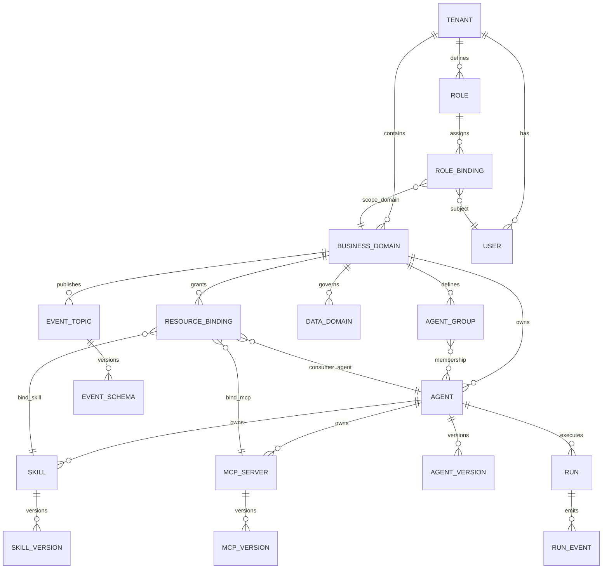

# 企业级智能体中台总体方案

**执行摘要**：本方案面向“企业级智能体中台（Agent Platform / AgentOps 平台）”建设目标，提出一套可落地、可扩展、可治理的总体架构与实施路线，用于按业务域管理多智能体群（多智能体拓扑/协作）、统一管理 Skill（工具/技能）与 MCP 服务（Model Context Protocol Server），并支持“技能与 MCP 默认归属于单个智能体、也可在业务域内共享、以及按租户维度共享/隔离”的资源治理模型。方案强调：以元数据/控制面统一编排与权限治理，以事件驱动/消息总线连接运行面，以标准化接口契约（OpenAPI/AsyncAPI/MCP）实现可演进集成，并以可观测性（OpenTelemetry）与 SLO/错误预算驱动运维治理，最终达到“可控上线、可回滚、可审计、可成本度量”的企业级交付标准。MCP 作为连接外部系统与工具的开放协议，其基于 JSON-RPC 2.0 的 Host/Client/Server 架构及 Tools/Resources/Prompts 能力为本中台的“工具生态与安全连接”提供了标准化接口基础。citeturn4view0turn4view1turn5search0turn0search5turn0search2turn0search7turn10search4

## 目标与范围

本节明确中台边界、默认假设与“未指定”项，并给出对技术团队可执行的目标拆解与验收口径。

**目标**  
中台目标定义为“四个统一”：

1) **统一资产管理**：以业务域为一级分组，统一管理智能体群、Skill、MCP 服务、数据域与事件契约，实现可发现、可复用、可版本化。  
2) **统一编排调度**：提供任务流/对话流编排与跨智能体协作能力，支持事件驱动与长流程可靠执行（durable execution）。citeturn1search19turn1search7turn1search3turn0search10  
3) **统一安全合规**：提供认证鉴权、细粒度授权、审计、隔离与敏感信息治理；对 MCP 的“用户同意与控制、数据隐私、工具安全”要求做企业级落地。citeturn4view0turn6search1turn6search0turn7search0turn3search2  
4) **统一可观测与治理**：以 OpenTelemetry 为主干，实现日志/指标/链路追踪关联治理，支持成本度量与配额限流。citeturn0search7turn0search11turn9search0turn9search8turn9search10  

**范围与“未指定”项（需在立项时补齐）**

| 维度 | 结论 | 说明/建议 |
|---|---|---|
| 支持的业务域类型 | **未指定** | 建议按“业务能力域/产品线域/职能域”三类建模（如客服、风控、运营、研发效能等），本方案以“可扩展域模型”支持任意域。 |
| 多智能体规模 | **未指定** | 建议在容量规划中给出目标区间（如 50/200/1000+ 智能体），并明确峰值并发会话/任务数、工具调用 QPS、事件吞吐。 |
| 是否支持跨域共享 | **建议支持** | 通过“资源绑定（Binding）+策略（Policy）”实现：默认域内共享，跨域需审批与显式授权。 |
| 租户隔离 | **建议支持** | 企业内部多团队可视为“逻辑租户”；外部多客户则为“强隔离租户”。可参考 Kubernetes 多租户最佳实践与隔离挑战（安全、公平、噪音邻居）。citeturn3search3turn3search27 |
| 合规要求 | **未指定** | 若涉及中国大陆个人信息/重要数据：建议以《个人信息保护法》《数据安全法》《网络安全法》及等保相关标准为基线；并可对标 ISO/IEC 27001 的 ISMS。citeturn7search3turn8search0turn8search1turn8search2turn8search3 |
| 预算 | **未指定** | 本方案给出“成本估算维度”，需结合 GPU/模型调用、存储、带宽与人力确定预算。 |

**验收的核心指标（建议写入项目章程）**  
以“能力可交付”为验收导向：  
- 智能体/Skill/MCP 的注册、版本、灰度、回滚、退役全链路可用；  
- 跨智能体编排支持至少一种可靠执行引擎（建议 Temporal 类 durable execution）；citeturn1search19turn1search3  
- 安全：OIDC 登录、RBAC/ABAC、审计与多租户隔离策略落地；citeturn6search1turn1search1turn3search2turn3search3  
- 可观测：基于 OpenTelemetry 的端到端 trace 贯通，关键 SLI 可被 Prometheus/Grafana 看板展示并告警。citeturn0search7turn9search0turn9search1  

## 概念模型

本节定义中台的核心实体、属性与关系，并给出 ER 图（Mermaid）。

**实体定义（与需求对齐）**  
- **业务域（BusinessDomain）**：按“业务边界”聚合智能体群、共享资源、数据域与事件契约，是权限与成本核算的核心边界。  
- **智能体（Agent）**：可部署的运行单元（服务/容器/函数），拥有提示词/策略/记忆/工具引用；可属于一个业务域并可加入多个群组。  
- **Skill**：可被智能体或编排引擎调用的“能力单元”，可实现为内部微服务 API、函数、脚本或工作流节点。建议用 OpenAPI 描述 HTTP 契约（可生成 SDK/测试）。citeturn5search5turn5search30  
- **MCP/Service（MCP Server）**：实现 MCP 协议的服务端，向 MCP Client 暴露 Tools/Resources/Prompts；MCP 使用 JSON-RPC 2.0 消息，Host/Client/Server 架构需在中台中显式建模。citeturn4view0turn5search0  
- **用户/角色（User/Role）与权限（Permission/Policy）**：用于 UI/控制面操作与运行时访问控制。建议以 OIDC/OAuth2 作为身份层，结合 RBAC/ABAC 做细粒度授权。citeturn6search1turn6search0turn1search1  
- **数据域（DataDomain）**：对接企业数据资产（知识库、业务库、对象存储等）的治理单元，带敏感分级、保留策略、访问策略。  
- **事件/消息（Event/Message）**：跨智能体、跨服务的通讯与解耦机制；建议采用 CloudEvents 作为事件封装标准，并用 AsyncAPI 管理事件契约。citeturn5search3turn5search2  

**核心关系原则**  
- Skill 与 MCP 默认“归属单个智能体（OwnerAgent）”，但可通过 **共享策略（SharePolicy）** 与 **绑定关系（Binding）** 在业务域内共享或在租户维度共享。  
- 权限与共享不是“复制资源”，而是“引用资源+策略裁剪”，避免分叉与版本失控。  
- 事件契约与数据域契约必须可版本化，且与智能体/工作流版本绑定，确保回滚可行。

**ER 图（Mermaid）**（建议中台元数据落库时以此为蓝本）



该模型强调：租户/域是治理边界；Agent/Skill/MCP 是可部署资产；Binding/Policy 是共享与隔离的关键控制点；事件与数据域是“连接业务系统与智能体系统”的标准化接口层。citeturn3search3turn4view0turn5search2turn5search3  

## 核心平台能力设计

本节合并回答：多智能体管理、Skill 与 MCP 管理、编排与调度，并给出请求流程图（Mermaid）。

### 多智能体管理

**生命周期管理（注册、部署、版本、回滚、退役）**  
建议将智能体作为“可版本化+可回滚”的发布单元，流程以 GitOps/声明式为主：

- **注册**：提交 AgentSpec（元数据、依赖、权限、资源限额、工具引用、事件订阅），生成唯一 AgentId。  
- **部署**：由控制面下发到运行面（容器/函数/服务），推荐以声明式资源驱动（如 CRD/Controller 模式），便于审计与自动对账。Kubernetes CRD 可扩展 API 并由集群负责存储与处理自定义资源。citeturn1search0turn1search4  
- **版本管理**：AgentVersion 绑定（镜像/配置/提示词/工作流引用/Skill& Mpc 引用的版本约束）。  
- **回滚**：支持“配置回滚、镜像回滚、依赖回滚”，并要求事件契约兼容。渐进式发布可用 canary/blue-green 策略。citeturn10search10turn10search2turn10search6  
- **退役**：冻结新流量→迁移依赖→归档审计材料→删除运行实例→保留必要元数据（符合保留策略）。

**群组与拓扑（多智能体协作模式）**  
建议预置三类拓扑模板，并允许在编排中组合：  
- **协调者-执行者（Hub-and-Spoke）**：一个 Router/Planner Agent 根据意图分发给多个执行 Agent。适用于客服/运营。  
- **分层树（Hierarchical）**：上层负责规划与审批，下层负责执行与工具调用。适用于风控/财务等需要“解释与责任链”的场景。  
- **群体协作/评审（Swarm/Committee）**：多个 Agent 并行产出候选方案，再由裁决 Agent 选择或融合。多智能体对话框架可参考 AutoGen 等研究/工程实践。citeturn0search5turn0search1  

**依赖管理**  
- 依赖对象包括：Skill/MCP、数据域（连接器/权限）、事件主题（topic/schema）、模型服务（推理 endpoint）。  
- 推荐采用“显式依赖图 + 版本约束 + 兼容性规则”，并在发布前做静态校验（缺依赖、越权引用、版本不兼容）。  
- 对运行时调用链，强制注入 TraceId/RunId（见“监控与治理”）。

**共享与隔离策略（默认安全）**  
- **默认归属**：Skill/MCP 归属 OwnerAgent，仅该 Agent 可用。  
- **域内共享**：域管理员可创建 Binding，使同域多个 Agent 引用同一 Skill/MCP；权限按最小化裁剪，且可设置配额与并发上限。  
- **跨域共享**：需显式跨域 Binding + 审批流；跨域调用建议走专用网关/隔离网络策略。  
- **租户隔离**：逻辑租户以命名空间、配额、网络策略、审计分流实现；Kubernetes 多租户重点挑战包含安全与“噪音邻居”，应以配额与策略控制。citeturn3search3  

### Skill 与 MCP 管理

**归属模型（单体归属、域共享、租户共享）**  
建议统一为三层作用域（Scope）+ 绑定（Binding）：

- **Agent Scope**（默认）：Skill/MCP `scope=agent`，仅 OwnerAgent 可调用。  
- **Domain Scope**：`scope=domain`，域内 Agent 可引用；引用仍需 Binding，便于细分到具体消费者。  
- **Tenant Scope**：`scope=tenant`，同租户跨域可共享；仍需 Binding 与策略裁剪。  
（可选）Platform Scope：平台内置能力（如基础检索/基础读写）但建议谨慎，避免“隐形共享”扩大风险面。

**接口规范（API、契约）**  
- Skill 若为 HTTP API：建议以 OpenAPI（OAS 3.x）固化输入输出、鉴权方式与错误码，便于生成 SDK、契约测试与网关治理。citeturn5search30turn5search5  
- 事件契约：建议以 AsyncAPI 描述消息通道、Payload Schema、订阅/发布关系。citeturn5search2turn5search22  
- MCP：按 MCP 规范实现，协议基于 JSON-RPC 2.0，Host/Client/Server 之间通过 JSON-RPC 消息交互；Server 侧可提供 Resources/Prompts/Tools，具备能力协商与安全要求。citeturn4view0turn5search0turn4view1  

**版本与兼容性策略**  
- **SkillVersion**：建议采用语义化版本（SemVer）并定义“破坏性变更”标准（字段删除、语义变更、鉴权变更等必须 major）。  
- **契约兼容测试**：  
  - HTTP：基于 OpenAPI 的 contract test（consumer-driven 或 provider contract）。  
  - 事件：AsyncAPI + Schema Registry（建议引入兼容性检查）。  
- **MCP Server 版本**：  
  - MCP 协议版本：跟随 MCP 官方规范版本；Host/Client 能力协商必须通过。citeturn4view0  
  - 工具集合版本：Tools/Resources/Prompts 作为“能力清单”也要版本化，避免线上 Agent 因工具变化导致行为漂移。

**沙箱与权限控制（工具即风险面）**  
MCP 规范明确指出：协议赋予任意数据访问与代码执行路径，必须强调用户同意、数据隐私与工具安全。citeturn4view0turn4view1  
因此中台需在运行时强制落实：  
- **网络与执行隔离**：Skill/MCP 服务运行在隔离命名空间与网络策略下；对高风险工具（写 DB、发消息、执行代码）额外隔离。  
- **最小权限**：对集群资源与平台 API 使用 RBAC；Kubernetes RBAC 的 Role/ClusterRole/Binding 模型可作为参考实现。citeturn1search1turn1search5  
- **准入控制**：用策略引擎对“资源创建/更新”做拦截与审计（Admission Control）；OPA/Gatekeeper 是常见的 Kubernetes 策略落地方式。citeturn7search1turn7search9  
- **工作负载安全基线**：采用 Pod Security Standards（privileged/baseline/restricted）并逐步收敛到更严格档位。citeturn7search0turn7search4  

**运行时调度与路由策略（工具调用如何落到实例）**  
- **路由输入**：RunId、Tenant/Domain、AgentId、Skill/MCPId、版本约束、调用者身份与授权上下文。  
- **路由决策**：优先选择同可用区/同机房实例；支持权重分流（灰度）与基于 header/claims 的路由。服务网格的流量治理能力（超时、重试、断路器、金丝雀、百分比流量切分）可直接承载这类策略。citeturn1search6turn10search31  
- **峰值控制**：对单 Skill/MCP 设置并发与 QPS 配额；对单域设置预算/配额；对租户设置资源上限（CPU/GPU/内存/存储）。

### 编排与调度（任务流/对话流、事件驱动、限流与恢复）

**编排对象**  
- **对话流（Conversation Flow）**：用户多轮对话 + 工具调用 + 变量状态。  
- **任务流（Task/Workflow）**：长流程（如“收集资料→审批→执行→回执”），需要可靠重试与幂等。Temporal 将“durable execution（崩溃无感执行）”作为核心理念，并通过事件历史保证工作流可恢复。citeturn1search19turn1search3turn1search15  
- **图编排（Stateful Graph）**：对复杂多分支/循环的智能体过程，可采用 LangGraph 类“有状态工作流/多智能体图”。citeturn0search2turn0search10  

**跨智能体协作模式（平台内置）**  
- **同步调用**：A→B 作为子任务，适合短链路。  
- **异步事件**：A 发布事件，B/C 订阅处理，适合解耦与扩展；事件格式建议 CloudEvents。citeturn5search3turn5search7  
- **编排驱动**：Orchestrator 统一调度多个 Agent 与工具，确保全局幂等、补偿、重试与超时策略。

**消息总线/事件驱动设计**  
- 建议将“命令（Command）”与“事件（Event）”分开 topic；  
- 需要高吞吐和持久化：采用 Kafka 类事件流平台；其复制机制是保证持久性与可用性的关键要素之一。citeturn2search0turn2search36  
- 需要低延迟与请求-应答式异步：可引入 NATS JetStream，其消费者可提供至少一次投递语义，并支持消息存储与回放。citeturn2search5turn2search1turn2search9  

**优先级与限流**  
- 资源维度：租户→域→Agent→Skill/MCP 分级配额（token、QPS、并发、CPU/GPU）。  
- 业务维度：给工作流/队列引入优先级（P0/P1/P2），并与错误预算策略联动（见“运维与 SLA”）。citeturn10search0turn10search8  

**故障恢复与重试**  
- **重试分类**：网络抖动、依赖超时、幂等失败、权限拒绝、业务校验失败（不可重试）。  
- **重试执行**：长流程建议交给 durable execution 引擎托管；服务网格补充短超时/短重试/熔断。citeturn1search6turn1search19  

**请求流程图（Mermaid）**（从用户到多智能体协作与工具调用）

```mermaid
flowchart TD
  U[User/Client] --> GW[API Gateway / BFF]
  GW --> AUTH[AuthN/AuthZ (OIDC/OAuth2 + Policy)]
  AUTH --> RT[Agent Router]
  RT --> ORCH[Orchestrator / Workflow Engine]

  ORCH --> A1[Agent Runtime: Planner]
  ORCH --> A2[Agent Runtime: Executor]
  ORCH --> BUS[Event Bus]

  A1 -->|invoke| SK[Skill Runtime]
  A2 -->|invoke| MCPCL[MCP Client]
  MCPCL --> MCPS[MCP Server]

  SK --> DATA[Enterprise Systems / Data Domain]
  MCPS --> DATA

  BUS --> OBS[Telemetry (Logs/Metrics/Traces)]
  SK --> OBS
  A1 --> OBS
  A2 --> OBS
  MCPS --> OBS

  ORCH --> GW
  GW --> U
```

该流程中：MCP Server 作为标准化“工具/资源/提示”提供方，以 JSON-RPC 2.0 通信；Skill 则以 OpenAPI/事件契约纳入同一治理体系；全链路通过 OpenTelemetry/观测栈关联 RunId/TraceId，保证可审计与可回滚。citeturn4view0turn5search0turn5search30turn0search7  

## 安全与合规

本节给出企业级最小安全闭环：认证鉴权、细粒度权限、审计、数据隔离、敏感信息处理。合规要求若未指定，需明确标注并给出建议基线。

### 认证鉴权与身份体系

**用户身份（控制面/UI）**  
- 建议采用 OIDC 统一登录（对接企业 IdP），OIDC 是构建在 OAuth 2.0 之上的身份层。citeturn6search1turn6search0  
- Token 建议采用 JWT（RFC 7519）承载 claims（租户、域、角色、权限范围等）。citeturn6search2  

**服务身份（运行面/服务到服务）**  
- 建议在服务网格内使用工作负载身份体系（如 SPIFFE ID），SPIFFE 将 workload 身份表示为 URI 并用于工作负载身份与验证文档（SVID）。citeturn6search3turn6search7turn6search36  
- 网格安全建议开启 mTLS；Istio 提供无侵入方式启用服务间 mutual TLS。citeturn10search27turn10search1  

### 细粒度权限与策略模型

**控制面权限**  
- 推荐“域/租户”作为授权边界：域管理员可管理域内 Agent/Skill/MCP/Binding；平台管理员管理租户与全局策略。  
- Kubernetes RBAC 的 Role/ClusterRole/Binding 分层模型可用于类比：域内为 Role，跨域/平台为 ClusterRole。citeturn1search1turn1search5  

**运行时权限（调用与数据访问）**  
- “资源绑定（Binding）”决定谁能引用 Skill/MCP；“策略（Policy）”决定调用时能做什么（read/write、数据域范围、速率、时间窗口等）。  
- 对策略实施位置：  
  - **入口**：API Gateway/BFF（用户态）  
  - **服务间**：网格 AuthorizationPolicy（服务到服务）citeturn1search2turn1search22  
  - **资源变更**：Admission Control（OPA/Gatekeeper）citeturn7search1turn7search9  

### 审计与数据隔离

**审计**  
- 必须区分“控制面审计”（谁创建/修改资源）与“运行面审计”（谁在何时调用了什么工具访问了什么数据）。  
- Kubernetes 审计日志提供“安全相关、按时间顺序的记录”，可用于追踪集群行为。citeturn3search2  

**数据隔离**  
- 租户隔离建议落到：命名空间隔离、网络策略隔离、资源配额、密钥隔离（不同 KMS/Vault path）。Kubernetes 多租户文档强调共享集群的安全与公平挑战。citeturn3search3  
- 敏感配置建议引入秘密管理系统（如 Vault），Vault Kubernetes auth 允许 Pod 使用 ServiceAccount Token 登录并获取 Vault token，降低静态凭据风险。citeturn7search2  

### 敏感信息处理与工具安全

**敏感信息处理**（建议内置为平台能力）  
- 数据分级（公开/内部/敏感/高度敏感）与最小化共享；  
- 日志脱敏（PII/密钥/Token），并禁止在工具调用日志中落明文凭据；  
- Prompt 注入与工具滥用防护：  
  - 工具白名单 + 细粒度 scope；  
  - MCP 侧强调“用户显式同意、可解释的工具行为、对工具描述不盲信”。citeturn4view0turn4view1  

**合规要求**：**未指定**  
若业务在中国大陆或处理中国境内自然人个人信息，建议至少对齐：  
- 《中华人民共和国个人信息保护法》citeturn7search3  
- 《中华人民共和国数据安全法》citeturn8search0  
- 《中华人民共和国网络安全法》（注意其已在 2025 年修正，需以最新条文为准）citeturn8search1  
- 等保相关国家标准（如 GB/T 22239-2019）citeturn8search2  
并可在管理体系上对标 ISO/IEC 27001（ISMS）。citeturn8search3  

## 监控与治理

本节给出指标体系、日志与链路追踪、告警策略，以及治理控制台功能清单。

### 指标体系与 SLO

建议将指标分为四类，并以 SLO/错误预算治理发布节奏。Google SRE 体系强调：SLO 可推导 error budget，并据此制定“预算耗尽时如何管理变更”的政策。citeturn10search0turn10search8turn10search4  

1) **可用性（Availability）**：端到端成功率、关键路径可用性（网关→编排→Agent→工具→数据）。  
2) **延迟（Latency）**：P50/P95/P99 总延迟与分段延迟（LLM 推理、工具调用、检索）。  
3) **成功率（Success）**：任务完成率、工具调用成功率、重试后成功率、人工兜底率。  
4) **成本（Cost）**：按租户/域/Agent/Skill/MCP 细分：  
   - 模型调用 token 成本或 GPU 秒；  
   - 工具调用成本（外部 API/DB/带宽）；  
   - 观测与存储成本（日志/trace/对象存储）。

### 日志、链路追踪与指标采集

**OpenTelemetry 统一采集**  
OpenTelemetry 规范覆盖 traces/metrics/logs，并强调标准化与可关联。citeturn0search7turn0search11turn0search22  

**指标与看板**  
- Prometheus 提供维度化指标模型与查询/告警能力。citeturn9search0turn9search3  
- Grafana Dashboard 将多个面板组织为一体，提供“相关信息一览”。citeturn9search1  

**日志**  
- Loki 是面向日志的可扩展、多租户聚合系统，强调只索引 label 元数据并降低成本。citeturn9search8turn9search5  

**分布式追踪**  
- Jaeger 作为 CNCF 毕业的分布式追踪平台，与 OpenTelemetry 对齐并在 v2 架构上基于 OpenTelemetry Collector。citeturn9search10  

### 告警策略（建议）

告警要与错误预算关联：SRE 的“基于 SLO 的告警”强调应对消耗大量错误预算的事件进行告警，以降低告警噪音并集中处理真正影响用户的故障。citeturn10search15  

建议制定：  
- **P0**：端到端不可用、权限系统故障、审计链路断裂、跨租户数据泄露迹象（立即升级）。  
- **P1**：核心域任务成功率低于阈值、关键 Skill/MCP 高失败或高延迟、消息积压。  
- **P2**：成本异常、容量接近上限、灰度偏差。

### 治理控制台功能清单（面向交付）

建议控制台分区：  
- **资产**：业务域/Agent/Skill/MCP 的注册、搜索、标签、依赖图、版本历史、变更记录；  
- **编排**：工作流/对话流编辑、发布、运行态查看、重试/补偿；  
- **权限**：角色、策略、Binding、审批流、租户/域视图；  
- **运行**：实例状态、拓扑、队列、限流与配额、熔断/降级开关；  
- **观测**：按租户/域/Agent 维度的指标/日志/trace，RunId 一键定位；  
- **审计**：操作审计、运行审计、数据访问审计、报表导出；  
- **成本**：成本分摊、预算、异常检测；  
- **安全**：密钥/凭据引用、敏感信息治理策略、策略基线（PSS/OPA）状态。citeturn7search0turn7search1turn3search2turn0search7  

## 技术选型与参考架构

本节给出推荐技术栈与权衡，并提供高层架构图（Mermaid）。选型优先引用官方/权威资料。

### 技术选型建议与权衡

以下选型假设：平台以云原生为基座，强调声明式发布、可扩展控制面与可治理运行面。

**核心基础设施与平台组件（推荐）**

| 领域 | 推荐选型 | 关键理由 | 主要权衡 |
|---|---|---|---|
| 容器编排/资源编排 | entity["organization","Kubernetes","container orchestration"] | 支持 CRD 扩展 API，便于把 Agent/Skill/MCP 作为声明式资源治理；并提供 HPA 自动扩缩容。citeturn1search0turn3search0 | 多租户隔离与噪音邻居需额外治理（配额/网络策略/准入）。citeturn3search3 |
| 服务网格 | entity["organization","Istio","service mesh"] | 流量治理（超时/重试/金丝雀）、L7 授权策略、mTLS，适合工具调用与跨服务安全。citeturn1search6turn1search2turn10search27 | 学习与运维复杂度增加，需规范化配置。 |
| 消息/事件中间件 | entity["organization","Apache Kafka","event streaming"] +（可选）entity["organization","NATS","messaging system"] | Kafka 适合高吞吐持久化事件流；NATS JetStream 提供持久化与至少一次语义、易于低延迟分发。citeturn2search0turn2search36turn2search5turn2search1 | 双总线提高复杂度；若团队较小可先单选 Kafka。 |
| 工作流/可靠执行 | entity["organization","Temporal","workflow engine"] | durable execution（崩溃无感）、事件历史、长流程可恢复；适合企业级“跨系统长事务”。citeturn1search19turn1search15turn1search3 | 引入额外平台组件，需要 Worker 开发范式。 |
| 多智能体编排库（开发侧） | entity["organization","LangGraph","langchain agent framework"] / entity["organization","AutoGen","microsoft multi-agent"] | LangGraph 强调有状态工作流/图；AutoGen 强调多智能体对话与可编程交互模式。citeturn0search2turn0search5 | 更偏应用侧框架，需要平台制定标准与封装。 |
| 可观测性标准 | entity["organization","OpenTelemetry","observability standard"] | 统一 traces/metrics/logs 数据模型，支持关联与标准化采集。citeturn0search7turn0search11 | 需要系统性打点与规范字段。 |
| 指标/看板/日志/追踪 | entity["organization","Prometheus","metrics monitoring"] + entity["organization","Grafana","observability dashboards"] + entity["organization","Grafana Loki","log aggregation"] + entity["organization","Jaeger","distributed tracing"] | Prometheus 指标模型与告警；Grafana 看板；Loki 多租户日志；Jaeger 与 OpenTelemetry 对齐。citeturn9search0turn9search1turn9search8turn9search10 | Loki/Jaeger 存储与保留策略需控制成本。 |
| 推理/模型托管 | entity["organization","KServe","kubernetes model serving"] +（LLM 引擎）entity["organization","vLLM","llm serving engine"] 或 entity["organization","NVIDIA Triton Inference Server","model inference server"] | KServe 以 CRD 管理模型服务生命周期并支持版本与流量管理；vLLM 强调高吞吐 LLM serving；Triton 提供 HTTP/gRPC 推理服务并支持多框架。citeturn2search7turn2search27turn11search0turn11search1turn11search13 | LLM serving 需要 GPU 资源规划与批处理策略；Triton/vLLM 运维与性能调优成本不同。 |
| CI/CD 与渐进式发布 | entity["organization","Argo CD","gitops continuous delivery"] + entity["organization","Argo Rollouts","progressive delivery"] | Argo CD 以声明式 GitOps 持续对账；Argo Rollouts 提供 canary/blue-green 等高级发布。citeturn2search2turn2search6turn10search10turn10search2 | 需要 GitOps 流程与权限治理配套。 |
| 元数据存储/配置库 | entity["organization","PostgreSQL","relational database"] | 适合存储平台元数据、资源关系、审计索引。citeturn12search0 | HA/备份要规范化。 |
| 缓存/队列补充 | entity["organization","Redis","in-memory data store"] | 适合会话状态缓存、幂等 key、限流计数等。citeturn12search9turn12search1 | 长期状态不建议放 Redis。 |
| 对象存储 | entity["organization","MinIO","s3 compatible object storage"] 或云厂商 S3 | 适合日志归档、模型文件、知识库原文、trace 冷存。强调 S3 兼容。citeturn12search6turn12search10 | 需治理生命周期与访问策略。 |

> 接口标准建议：HTTP 用 OpenAPI；事件用 AsyncAPI + CloudEvents；MCP 用其官方规范（JSON-RPC 2.0）。citeturn5search30turn5search2turn5search3turn4view0turn5search0

### 高层架构图（Mermaid）

```mermaid
flowchart LR
  subgraph ControlPlane[Control Plane - 元数据与治理]
    UI[Console/UI]
    APIGW[API Gateway/BFF]
    Meta[Metadata Services: Domain/Agent/Skill/MCP/Binding]
    Policy[Policy Engine (RBAC/ABAC)]
    WF[Workflow/Orchestration Service]
    Reg[Registry: images/specs/schemas]
    Audit[Audit Service]
  end

  subgraph DataPlane[Data Plane - 运行与执行]
    AR[Agent Runtimes]
    SR[Skill Runtimes]
    MCPS[MCP Servers]
    MS[Model Serving]
  end

  subgraph Infra[Shared Infra]
    K8S[Cluster & Scheduling]
    Mesh[Service Mesh]
    Bus[Event Bus]
    Obs[Observability Stack]
    DB[(Metadata DB)]
    Obj[(Object Storage)]
  end

  UI --> APIGW --> Meta --> DB
  APIGW --> Policy
  Meta --> Reg
  Meta --> WF
  WF --> Bus
  WF --> AR
  AR --> SR
  AR --> MCPS
  AR --> MS
  SR --> Bus
  MCPS --> Bus
  Mesh --- AR
  Mesh --- SR
  Mesh --- MCPS
  Obs <-- AR
  Obs <-- SR
  Obs <-- MCPS
  K8S --- ControlPlane
  K8S --- DataPlane
  Obj --- Obs
```

该架构将“治理复杂度”收敛在控制面（资源、权限、版本、审计），将“弹性与性能”放在运行面（Agent/Skill/MCP/模型服务），并以事件总线与可观测栈打通全链路。控制面可通过声明式资源（CRD）实现自动对账；运行面通过网格实施安全与流量治理；编排通过 durable execution 引擎保证长流程可靠。citeturn1search0turn2search2turn10search10turn1search19turn0search7turn1search6turn4view0  

## 部署、扩展性与SLA

本节给出单租户/多租户部署、弹性扩展、灾备备份、成本估算维度与 SLA 建议。

### 单租户与多租户部署方案

**单租户（组织内单团队或单业务线）**  
- 优点：简单；可快速 PoC/MVP。  
- 风险：后续扩展到多团队时权限/隔离要重构。  
适用：PoC 与早期 MVP。

**多租户（推荐作为目标架构）**  
- 技术隔离层：命名空间、资源配额、网络策略、策略准入、审计分流。Kubernetes 多租户文档指出共享集群虽节省成本但带来安全与公平挑战，应使用最佳实践。citeturn3search3  
- 资源隔离策略（建议分级）：  
  - 逻辑租户：共享集群 + 强策略隔离；  
  - 强隔离租户：独立集群或 vcluster/独立网格控制面（视安全要求）。  

### 弹性扩展策略

**计算扩缩容**  
- 服务水平扩容：HPA 可自动更新工作负载副本数以匹配需求。citeturn3search0  
- 事件驱动扩容：KEDA 支持基于事件（如队列积压）驱动扩缩容，并与 HPA 协同工作。citeturn3search1turn3search9turn3search13  

**模型推理扩展**  
- 模型服务可通过 KServe CRD 管理版本与流量；KServe 也强调封装自动扩缩容与网络治理复杂度。citeturn2search7turn2search27  
- LLM 推理引擎可选 vLLM（高吞吐/连续批处理）或 Triton（多框架、HTTP/gRPC 推理服务）。citeturn11search0turn11search1turn11search13  

### 灾备与备份策略

**需要覆盖的资产**  
- 元数据与审计：数据库（建议主从/多 AZ）+ 定期备份；  
- 对象存储：日志/trace 冷存与模型文件，配置生命周期与跨站复制；  
- 消息总线：topic 配置、Schema Registry、关键事件保留；  
- 工作流状态：durable execution 引擎的状态存储与历史需要备份与演练（Temporal 的事件历史是可恢复基础）。citeturn1search19turn1search15  

**演练建议**  
- 每季度一次“故障演练”：数据库主库故障、消息总线故障、模型服务故障、权限系统故障；  
- 每月一次“回滚演练”：Agent/Skill/MCP 的版本回滚 + 兼容性验证。

### 成本估算维度（预算未指定）

由于预算 **未指定**，建议按维度估算并建立成本台账：  
- **模型成本**：GPU 资源（卡型、利用率、batch 策略）、或第三方模型 API token 成本；  
- **工具调用成本**：外部 API/短信/邮件/搜索等；  
- **基础设施成本**：集群节点、总线、存储、观测；  
- **数据成本**：向量库/检索索引、对象存储、冷热分层；  
- **人力成本**：平台研发、SRE、治理运营、合规与安全审计。

### SLA 建议与 SLO/错误预算

SLA 建议需要与业务关键程度绑定；平台应以 SLO 驱动，并用错误预算管理发布节奏。SRE 体系指出要求 100% 达标不现实，错误预算用于平衡创新与可靠性。citeturn10search4turn10search0  

建议（可作为初始值，需与业务方确认）：  
- 控制面（Console/API）：月度可用性 99.9%  
- 运行面（核心对话/任务）：月度可用性 99.9% 或更高（视业务）  
- 关键工具（支付/风控/通知）：按依赖重要性设置更高 SLO，并引入降级策略与人工兜底。

## 实施路线与附录

本节给出分阶段交付、里程碑、时间范围（未指定则给典型周期）、风险与缓解措施，并附示例 API 契约与数据模型表。

### 实施路线与里程碑（PoC、MVP、生产化）

**时间估算**：项目时间 **未指定**，给出典型周期范围（以中型企业团队为例，3–8 人平台团队）。  
- **PoC：4–8 周**（验证关键链路）  
  - 产出：  
    - 业务域/Agent/Skill/MCP 的最小注册与部署；  
    - 单一拓扑（协调者-执行者）+ 基础工具调用；  
    - 基础观测（trace 打通）；  
    - 最小权限（域级 RBAC）。  
  - 验收：端到端 Run 可执行、可追踪、可回滚一次。

- **MVP：8–16 周**（可试点上线）  
  - 产出：  
    - 版本管理、灰度发布（canary/blue-green）与回滚流程；citeturn10search10turn10search2  
    - 资源绑定（域共享、租户隔离）与审批流；  
    - 事件总线 + CloudEvents 规范落地；citeturn5search3  
    - 可观测体系：Prometheus+Grafana+Loki+Jaeger 基线看板与告警；citeturn9search0turn9search8turn9search10  
    - 审计日志闭环（控制面+运行面）。citeturn3search2  

- **生产化：12–24 周**（规模化、治理化）  
  - 产出：  
    - 多拓扑、多工作流引擎（durable execution）与跨域共享治理；citeturn1search19  
    - 成本核算与预算、配额与限流、容量自动扩缩容（HPA/KEDA）；citeturn3search0turn3search1  
    - 安全基线：mTLS、策略准入（OPA）、Pod Security Standards 分档落地；citeturn10search27turn7search1turn7search0  
    - 灾备演练与 SLO/错误预算治理流程固化。citeturn10search8turn10search0  

### 风险与缓解措施（关键项）

- **工具/数据权限失控（高风险）**：通过 Binding+Policy、默认最小权限、审计与准入控制；对 MCP 工具执行按显式同意与白名单。citeturn4view0turn7search1turn1search1  
- **版本与契约漂移导致不可回滚**：强制 OpenAPI/AsyncAPI/MCP 能力清单版本化；发布前做兼容性检查与合同测试。citeturn5search30turn5search2turn4view0  
- **多租户噪音邻居**：配额、限流、隔离命名空间与网络策略，并建立容量报警。citeturn3search3turn3search0  
- **成本不可控（尤其 GPU/模型）**：从 MVP 起引入成本维度指标与预算；对高成本调用设置配额和降级策略。  

### 附录：示例 API 契约（节选）

以下为“中台控制面 API”示例（OpenAPI 风格节选），用于说明契约结构；实际应按组织规范补充鉴权、错误码与审计字段。OpenAPI 作为描述 HTTP API 的标准可用于自动生成文档/SDK。citeturn5search30turn5search5  

```yaml
openapi: 3.1.0
info:
  title: Agent Platform Control Plane API
  version: 0.1.0
paths:
  /tenants/{tenantId}/domains:
    post:
      summary: Create business domain
      security:
        - oidc: [domain.write]
      requestBody:
        required: true
        content:
          application/json:
            schema:
              type: object
              required: [name, ownerTeam]
              properties:
                name: { type: string }
                ownerTeam: { type: string }
                description: { type: string }
      responses:
        "201":
          description: Created
  /tenants/{tenantId}/domains/{domainId}/agents:
    post:
      summary: Register agent
      security:
        - oidc: [agent.write]
      requestBody:
        required: true
        content:
          application/json:
            schema:
              type: object
              required: [name, runtime, version]
              properties:
                name: { type: string }
                runtime:
                  type: object
                  properties:
                    image: { type: string }
                    resources: { type: object }
                version: { type: string }
                dependencies:
                  type: object
                  properties:
                    skills: { type: array, items: { type: string } }
                    mcpServers: { type: array, items: { type: string } }
  /skills/{skillId}/versions:
    post:
      summary: Publish a new skill version
  /mcpServers/{mcpId}/versions:
    post:
      summary: Publish a new MCP server version
  /bindings:
    post:
      summary: Bind a skill/MCP to a consumer agent with policy constraints
```

### 附录：示例数据模型表（核心字段）

| 实体 | 关键字段（示例） | 说明 |
|---|---|---|
| BusinessDomain | id, tenantId, name, ownerTeam, tags, createdAt | 治理边界与成本核算维度 |
| Agent | id, domainId, name, runtimeRef, status, defaultPolicyRef | 可部署运行单元 |
| Skill | id, ownerAgentId, scope(agent/domain/tenant), openapiRef, riskLevel | 工具/能力单元 |
| MCPServer | id, ownerAgentId, scope, endpoint, capabilityManifest, riskLevel | MCP 服务端资产（Tools/Resources/Prompts）citeturn4view0 |
| ResourceBinding | id, resourceType, resourceId, consumerAgentId, constraints, approvalState | 共享与隔离的核心控制点 |
| EventSchema | id, topic, version, schemaRef, compatibility | 事件契约版本化（建议 AsyncAPI/Schema Registry）citeturn5search2 |
| Run | id, tenantId, domainId, agentId, traceId, status, cost | 执行记录（观测与成本核算） |

### 附录：关键决策点清单（立项必须拍板）

- 业务域划分与治理职责（域 owner/平台 owner）  
- 多租户级别（逻辑隔离 vs 强隔离）与合规要求（未指定需补齐）citeturn3search3turn7search3turn8search2  
- 事件总线单选还是双总线（Kafka vs Kafka+NATS）citeturn2search0turn2search5  
- 工作流引擎选择（Temporal/其他）与与对话编排框架（LangGraph/AutoGen）的边界citeturn1search19turn0search2turn0search5  
- 模型托管模式（自建 KServe/vLLM/Triton vs 云托管）citeturn2search7turn11search0turn11search13  
- 安全基线：mTLS、Pod Security Standards 档位、OPA/准入策略治理范围citeturn10search27turn7search0turn7search1  

### 附录：参考资料（优先官方/权威/原始论文/中文资料）

- MCP：规范与安全原则（JSON-RPC 2.0、Tools/Resources/Prompts、用户同意与工具安全）citeturn4view0turn4view1turn5search0  
- 多智能体工程实践：AutoGen（Microsoft Research 论文/页面）citeturn0search5turn0search1  
- 有状态工作流/图编排：LangGraph 文档citeturn0search2turn0search10  
- OpenTelemetry 规范与日志概念citeturn0search7turn0search11turn0search14  
- Kubernetes：CRD、RBAC、多租户、审计、HPAciteturn1search0turn1search1turn3search3turn3search2turn3search0  
- Istio：流量治理、授权策略、mTLSciteturn1search6turn1search2turn10search27turn10search1  
- Temporal：Workflow 与 durable execution 相关文档与说明citeturn1search19turn1search7turn1search3  
- 事件标准：CloudEvents、AsyncAPI、OpenAPIciteturn5search3turn5search2turn5search30  
- 观测栈：Prometheus、Grafana、Loki、Jaeger 官方资料citeturn9search0turn9search1turn9search8turn9search10  
- 推理与模型托管：KServe、vLLM、NVIDIA Triton 官方资料与论文（PagedAttention/vLLM）citeturn2search7turn11search0turn11search1turn11academia36  
- 中国合规基线：个人信息保护法、数据安全法、网络安全法、GB/T 22239-2019（等保相关）citeturn7search3turn8search0turn8search1turn8search2  
- SLO/错误预算：Google SRE（SLO 与错误预算政策）citeturn10search4turn10search0turn10search8